# Architecture — C4 container view

Static container view of the proshop_mern stack with a data-flow overlay for **Place Order → Pay with PayPal** (the most cross-cutting end-to-end scenario in the codebase). Node labels use real file paths.

```mermaid
flowchart TB
  user(["User browser"])

  subgraph FE["Frontend — CRA dev :3000 (proxy /api → :5001)"]
    direction TB
    fe_store["frontend/src/store.js<br/>Redux + localStorage rehydrate"]
    fe_place["frontend/src/screens/PlaceOrderScreen.js"]
    fe_order["frontend/src/screens/OrderScreen.js"]
    fe_other_screens["frontend/src/screens/*<br/>(Login · Cart · Product · Profile · Admin*)"]
    fe_order_act["frontend/src/actions/orderActions.js<br/>createOrder · payOrder · deliverOrder"]
    fe_user_act["frontend/src/actions/userActions.js<br/>login · register · profile"]
    fe_prod_act["frontend/src/actions/productActions.js"]
    fe_cart_act["frontend/src/actions/cartActions.js"]
  end

  subgraph BE["Backend — Express :5001 (backend/server.js)"]
    direction TB

    subgraph BE_routes["Routes (HTTP entry points)"]
      direction TB
      r_order["backend/routes/orderRoutes.js<br/>/api/orders · /:id · /:id/pay · /:id/deliver · /myorders"]
      r_product["backend/routes/productRoutes.js<br/>/api/products · /:id · /:id/reviews · /top"]
      r_user["backend/routes/userRoutes.js<br/>/api/users · /login · /profile · /:id"]
      r_upload["backend/routes/uploadRoutes.js<br/>/api/upload (multer · jpg/jpeg/png)"]
      r_paypal_cfg["backend/server.js (inline)<br/>GET /api/config/paypal"]
      r_static["backend/server.js (inline)<br/>GET /uploads/* · SPA fallback (prod)"]
    end

    subgraph BE_mw["Middleware"]
      direction TB
      mw_auth["backend/middleware/authMiddleware.js<br/>protect · admin"]
      mw_err["backend/middleware/errorMiddleware.js<br/>notFound · errorHandler"]
    end

    subgraph BE_ctrl["Controllers"]
      direction TB
      c_order["backend/controllers/orderController.js<br/>addOrderItems · getOrderById<br/>updateOrderToPaid · updateOrderToDelivered<br/>getMyOrders · getOrders"]
      c_product["backend/controllers/productController.js"]
      c_user["backend/controllers/userController.js"]
    end

    util_token["backend/utils/generateToken.js<br/>jwt.sign (30d)"]

    subgraph BE_cli["CLI"]
      cli_seeder["backend/seeder.js<br/>npm run data:import · data:destroy"]
    end
  end

  subgraph DL["Data Layer"]
    direction TB
    db_conn["backend/config/db.js<br/>mongoose.connect"]
    mongo[("MongoDB<br/>orders · products · users")]
    fs[("uploads/ on host FS")]
  end

  subgraph EXT["External"]
    paypal["PayPal JS SDK<br/>www.paypal.com/sdk/js"]
  end

  %% --- baseline wiring ---
  user --> fe_store
  fe_store --- fe_place
  fe_store --- fe_order
  fe_store --- fe_other_screens
  fe_other_screens --> fe_user_act
  fe_other_screens --> fe_prod_act
  fe_other_screens --> fe_cart_act
  fe_user_act --> r_user
  fe_prod_act --> r_product
  fe_cart_act -.-> fe_store

  r_user --> mw_auth
  r_product --> mw_auth
  r_order --> mw_auth
  mw_auth --> c_user
  mw_auth --> c_product
  mw_auth --> c_order
  c_user --> util_token
  c_user --> mongo
  c_product --> mongo
  r_upload --> fs
  r_static --> fs
  cli_seeder --> db_conn
  db_conn --> mongo
  mw_err -. wraps .- BE_routes

  %% --- "Place Order → Pay with PayPal" overlay (numbered steps) ---
  fe_place ==>|"1. click Place Order"| fe_order_act
  fe_order_act ==>|"2. POST /api/orders + Bearer JWT"| r_order
  c_order ==>|"3. Product.find — authoritative prices (fix b7d6b09)"| mongo
  c_order ==>|"4. Order.save"| mongo
  c_order ==>|"5. 201 createdOrder"| fe_order_act
  fe_order_act ==>|"6. redirect /order/:id · CART_CLEAR_ITEMS"| fe_order
  fe_order ==>|"7. GET /api/orders/:id"| r_order
  fe_order ==>|"8. GET /api/config/paypal"| r_paypal_cfg
  fe_order ==>|"9. inject &lt;script src=paypal/sdk/js&gt;"| paypal
  paypal ==>|"10. onSuccess(paymentResult)"| fe_order_act
  fe_order_act ==>|"11. PUT /api/orders/:id/pay"| r_order
  c_order ==>|"12. isPaid=true · paymentResult · Order.save"| mongo
```

## Use case: Place Order → Pay with PayPal

Numbered to match the **bold edges** above.

1. Authenticated user on `PlaceOrderScreen` clicks **Place Order**. Cart items, shipping address, and payment method are read from the Redux `cart` slice (rehydrated earlier from `localStorage` by `frontend/src/store.js`).
2. `orderActions.createOrder` thunk POSTs to `/api/orders` with `Authorization: Bearer <JWT>`. The CRA dev proxy forwards `:3000/api/...` → `:5001`.
3. `orderRoutes` runs `protect` (decodes JWT, loads `User`), then `addOrderItems`. The controller fetches every product referenced in the request from MongoDB to get the authoritative price/name/image (introduced by fix `b7d6b09` — client-supplied prices are now ignored).
4. `addOrderItems` recomputes `itemsPrice / shippingPrice / taxPrice / totalPrice` via the local `calcPrices` helper (constants: `FREE_SHIPPING_THRESHOLD=100`, flat shipping `100`, `TAX_RATE=0.15`) and persists the `Order` to MongoDB.
5. Response `201 createdOrder` flows back to the thunk.
6. Thunk dispatches `ORDER_CREATE_SUCCESS` + `CART_CLEAR_ITEMS`, removes `cartItems` from `localStorage`, and `PlaceOrderScreen`'s `useEffect` pushes history to `/order/:id`.
7. `OrderScreen` mounts and `getOrderDetails` GETs `/api/orders/:id` (also `protect`-gated).
8. In parallel, `OrderScreen` fetches the PayPal client id from the inline endpoint `GET /api/config/paypal` (defined directly in `backend/server.js`).
9. `OrderScreen` injects a `<script src="https://www.paypal.com/sdk/js?client-id=...">` into `document.body` and waits for `onload` to set `sdkReady`.
10. The PayPal button (`react-paypal-button-v2`) handles the user-facing payment flow externally; on success it calls `successPaymentHandler(paymentResult)`.
11. `orderActions.payOrder` PUTs `/api/orders/:id/pay` with the PayPal `paymentResult` payload.
12. `updateOrderToPaid` sets `isPaid=true`, `paidAt=Date.now()`, copies `id / status / update_time / payer.email_address` from the payload into `paymentResult`, and saves. (See FINDINGS #6 — this endpoint currently doesn't verify the payer is the order's owner and doesn't null-check `req.body.payer`.)

## Notes for readers

- This codebase has **no other external services** (no Stripe, no SMTP, no Redis, no S3, no Postgres). PayPal is the only third-party data plane.
- Uploads (`POST /api/upload` via multer) write to the host filesystem under `uploads/`; the same files are served back by the static mount in `server.js`. On ephemeral hosts (Heroku) those files don't survive a restart.
- The seeder (`backend/seeder.js`) is the only non-HTTP entry point — it shares the Mongo connection from `config/db.js` and is invoked via `npm run data:import` / `npm run data:destroy`.
- Production differs from this picture only in that `server.js` also serves `frontend/build` and falls back to `index.html` for non-API routes; the dev proxy disappears.
