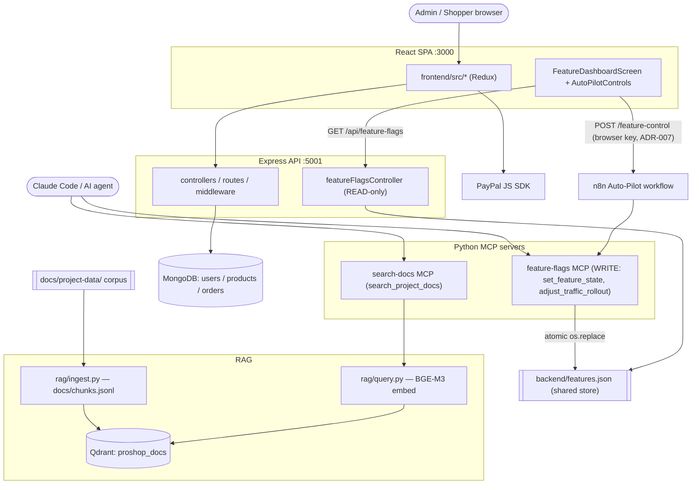

# System Architecture Overview — proshop_mern fork

High-level map of the **whole** system after M3–M5: the original MERN core plus
the AI-dev additions (two Python MCP servers, a Python RAG pipeline, a
feature-flags layer, and an n8n Auto-Pilot). For the file-level C4 container view
of the MERN core specifically, see [`../architecture.md`](../architecture.md).
For per-module deep-dives, see [`../specs/`](../specs/).

> Built in M6 Stage 3 (legacy audit) from the reverse-engineering specs +
> the Stage 1 code-review synthesis. Machine-readable map: [`/project-index.json`](../../project-index.json).

## The four runtimes

| Runtime | What it is | Entry | Spec |
|---|---|---|---|
| **Express API** | REST backend (products, users, orders, uploads, feature-flag reads) | `backend/server.js` | core C4: [`../architecture.md`](../architecture.md) |
| **React SPA** | CRA storefront + admin + M4 Feature Dashboard | `frontend/src/index.js` | — (see [`DESIGN.md`](../../DESIGN.md)) |
| **Python MCP servers** | feature-flags (write-path) + search-docs (vector search) | `mcp-servers/*/server.py` | [feature-flags-mcp](../specs/feature-flags-mcp-spec.md), [search-docs-mcp](../specs/search-docs-mcp-spec.md) |
| **Python RAG** | ingest corpus → Qdrant; query with BGE-M3 | `rag/ingest.py`, `rag/query.py` | [rag-pipeline](../specs/rag-pipeline-spec.md) |

## System map

## Key boundaries & decisions

- **`backend/features.json` is a single shared store** read by Express and written **only** by the feature-flags MCP (atomic temp-file + `os.replace`, dependency validation). See [ADR-006](../adr/adr-006-features-json-shared-store.md). The Express read-path never writes it; n8n mutates only via the MCP.
- **Auto-Pilot** flips flags through `browser → n8n → AI agent → MCP → features.json`, then the dashboard re-reads `GET /api/feature-flags`. The browser-held n8n key is M5 debt; target is to proxy through Express. See [ADR-007](../adr/adr-007-autopilot-n8n-mcp-pipeline.md).
- **search-docs MCP** is a thin adapter over `rag/query.py` (Qdrant + BGE-M3, collection `proshop_docs`, 471 chunks from `docs/chunks.jsonl`). Coupling is via `sys.path` injection — fragile but documented.
- **No service layer:** Express controllers hold business logic directly (legacy proshop convention). Server-side price calc in `orderController.calcPrices` is the one hardening over upstream.

## Known doc-vs-code divergences (M6 audit)

Tracked with `TODO(audit-2026-06-07)` markers in the corpus; full list in [`homework-m6/stage3-living-docs/docs-audit.md`](../../homework-m6/stage3-living-docs/docs-audit.md):

1. `docs/project-data/api/uploads.md` & `architecture.md` claim `POST /api/upload` is admin-only — code (`uploadRoutes.js:37`) has no auth.
2. `architecture.md` claims the userModel pre-save hook prevents re-hashing — code (`userModel.js:34`) is missing `return next()` (double-hash).
3. `runbooks/feature-flag-toggle.md` describes a MongoDB `FeatureFlag` collection that doesn't exist — real impl is `features.json` + MCP.

## Top risks (from Stage 1 synthesis)

The 3 highest were fixed in M6 Stage 2 (IDOR `getOrderById`, `getUsers` password-hash leak, `updateOrderToPaid` trust). Still open: unauthenticated `POST /api/upload`, public `GET /api/feature-flags`, no login rate-limit, dependency CVEs. Full report: [`homework-m6/stage1-code-review/synthesis.md`](../../homework-m6/stage1-code-review/synthesis.md).

## See also

- [`docs/project-data/dev-history.md`](../project-data/dev-history.md) — project timeline & incidents.
- [`docs/project-data/feature-flags-spec.md`](../project-data/feature-flags-spec.md) — the canonical flag contract.
- [`docs/adr/`](../adr/) — ADR-001..007.
