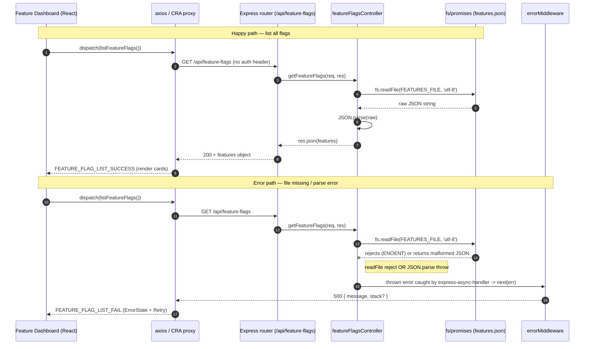

# Overview

This spec characterizes the **backend feature-flags read-path**: the Express HTTP
surface that lets clients read the contents of `backend/features.json`. It comprises
two pieces — `backend/controllers/featureFlagsController.js` (the handlers
`getFeatureFlags` and `getFeatureFlagByName`) and `backend/routes/featureFlagsRoutes.js`
(the router), mounted by `backend/server.js` at `app.use('/api/feature-flags', ...)`.
Both handlers are wrapped in `express-async-handler`, so any thrown error (a rejected
`fs.readFile`, a `JSON.parse` throw, or the explicit 404) propagates into the shared
`errorMiddleware.js` (`notFound` + `errorHandler`) rather than crashing the process.

**Two endpoints, one read primitive.** A private helper `readFeatures()` does
`fs.readFile(FEATURES_FILE, 'utf-8')` then `JSON.parse(raw)`, where
`FEATURES_FILE = path.join(path.resolve(), 'backend', 'features.json')`.
`GET /api/feature-flags` returns the whole object as-is. `GET /api/feature-flags/:name`
looks up `features[req.params.name]`; on a hit it returns the feature object
spread under an injected `feature_id` field, on a miss it sets `res.status(404)`
and throws `Feature '<name>' not found`.

**Shared-store / dual access path.** `features.json` is a plain JSON file that is the
single source of truth for all 25 flags. The Express layer here is **read-only**; the
**write side** is the Python feature-flags MCP server (`mcp-servers/feature-flags/server.py`),
which mutates the same file with an atomic write (write to a `NamedTemporaryFile` in the
same dir, then `os.replace`). Two independent processes touching one file with no shared
lock, schema, or transaction is the "dual access path" Stage 1 flagged as **C1 / ADR-006**
(decision never recorded — see Open Questions).

**No caching.** Every request re-reads and re-parses the entire file from disk. There is
no in-memory cache, no `fs.watch`, no ETag, no mtime check. Stage 1's perf finding: read +
parse cost is paid per request and scales with file size and request volume. For the
current ~300-line file this is negligible, but it is unbounded as the catalog grows.

**Public access.** Neither route composes `protect` or `admin` middleware — both are
literally `Public` (the controller comments say so). Anyone who can reach the server can
enumerate the full flag catalog, including unreleased/`Disabled` features and their
descriptions. This is Stage 1's **SEC-09**: internal roadmap leakage via an unauthenticated
config endpoint. (The admin gate that *does* exist is purely client-side, in the dashboard.)

**Dashboard consumption.** `frontend/src/actions/featureFlagActions.js` dispatches
`listFeatureFlags()`, an unauthenticated `axios.get('/api/feature-flags')` (no `Authorization`
header) whose payload feeds `FEATURE_FLAG_LIST_SUCCESS`. `frontend/src/screens/FeatureDashboardScreen.js`
gates rendering on `userInfo.isAdmin` *client-side only*, calls the action on mount, on
Refresh, and after every Auto-Pilot mutation (`handleUpdated` re-reads the source of truth),
then renders `Object.entries(features)` as cards.

## Decision Table

| # | Condition | Then-action | Else-action | Edge case |
|---|---|---|---|---|
| 1 | Request `GET /api/feature-flags` (no `:name`) | Route to `getFeatureFlags` | Falls through to `/:name` handler | A literal `/api/feature-flags/` with trailing slash still matches `/` route in Express v4 |
| 2 | Request `GET /api/feature-flags/<x>` | Route to `getFeatureFlagByName` with `params.name = <x>` | n/a | `<x>` is URL-decoded by Express before reaching the handler |
| 3 | `features.json` exists and is readable | `fs.readFile` resolves with file contents | `readFile` rejects (`ENOENT`/`EACCES`) → async-handler forwards to `errorHandler` | Mid-write rename window (MCP `os.replace`) — read sees either old or new file, never partial |
| 4 | File contents are valid JSON | `JSON.parse` returns object | `JSON.parse` throws `SyntaxError` → async-handler → `errorHandler` (500) | A truncated/half-written file would throw, but `os.replace` makes truncation effectively impossible |
| 5 | (list) parse succeeds | `res.json(features)` — entire object, 200 | n/a | Empty `{}` is returned verbatim as `{}` with 200, not an error |
| 6 | (by-name) `features[name]` is truthy | `res.json({ feature_id: name, ...feature })` 200 | Set `res.status(404)`, throw `Feature '<name>' not found` | Spread injects/overrides any pre-existing `feature_id` key in the object |
| 7 | (by-name) `name` matches a flag key exactly | Hit (case-sensitive) | Miss → 404 | `Search_V2` ≠ `search_v2`; keys are lowercase `snake_case` |
| 8 | (by-name) `name` collides with a JS Object.prototype key (`toString`, `constructor`, `__proto__`) | `features[name]` may resolve to an inherited function/object → treated as a "hit" | n/a | `JSON.parse` yields a plain object so own-keys dominate, but inherited names are still reachable → false 200 |
| 9 | (by-name) `name` is empty string (`/api/feature-flags/`) | Express treats as the `/` route (#1), not by-name | n/a | No empty-`:name` invocation occurs in practice |
| 10 | (by-name) `name` contains `/` (e.g. path traversal `..%2F`) | Express decodes; segment with literal `/` won't match single `:name` segment → likely 404 from router | n/a | No filesystem path is built from `name` — it is only a dict key lookup, so no real traversal risk |
| 11 | Any thrown/rejected error inside a handler | `express-async-handler` catches and calls `next(err)` → `errorHandler` JSON `{ message, stack? }` | n/a | `errorHandler` masks `stack` only when `NODE_ENV === 'production'` |
| 12 | `errorHandler` runs but `res.statusCode` is still 200 | Coerces to 500 | Keeps explicit status (e.g. 404 from #6) | A `JSON.parse` failure has no explicit status set → becomes 500 |
| 13 | Concurrent dashboard polls / many clients | Each request independently re-reads + re-parses the file | n/a | No request coalescing; N concurrent reads = N `fs.readFile` syscalls |
| 14 | Non-GET verb (`POST`/`PUT`/`DELETE` on either path) | No matching route handler → `notFound` middleware → 404 | n/a | Read-path router defines only `.get()`; writes must go through the MCP |
| 15 | Feature object missing optional fields (`dependencies`, `rollout_strategy`) | Returned as-is; dashboard renders conditionally | n/a | Backend does no schema validation or defaulting whatsoever |

## Sequence Diagram

## Edge Cases

- **File missing (`ENOENT`).** If `backend/features.json` is absent (fresh checkout gone
  wrong, bad cwd so `path.resolve()` points elsewhere), `fs.readFile` rejects and the request
  becomes a 500 via `errorHandler`. The dashboard shows its `ErrorState` with a Retry button.
- **File locked / unreadable (`EACCES`).** Wrong permissions on the file or its directory →
  `readFile` rejects → 500. No graceful fallback or cached last-good copy exists.
- **Mid-write race with the MCP.** The MCP writes via `tempfile.NamedTemporaryFile` + `os.replace`
  (atomic POSIX rename in the same directory). A concurrent Express `readFile` therefore observes
  either the complete old file or the complete new file — never a torn/partial read. This is the
  one race the design actually handles correctly, and only because the *writer* (not this read-path)
  is careful.
- **Malformed JSON.** If the file is hand-edited to invalid JSON (a forbidden manual edit per
  CLAUDE.md), `JSON.parse` throws `SyntaxError`; async-handler forwards it; `errorHandler` coerces
  the still-200 status to 500. Whole endpoint goes dark — no partial/best-effort parse.
- **Huge file / catalog growth.** No streaming, no pagination, no cache: a multi-megabyte
  `features.json` is read into memory and parsed on *every* request. Latency and CPU scale linearly
  with file size × request rate (Stage 1 perf finding); for 25 flags it's trivial, but unbounded.
- **Unknown flag name.** `GET /api/feature-flags/does_not_exist` → `features[name]` is `undefined`
  → explicit `res.status(404)` + thrown `Feature 'does_not_exist' not found`. This is the one
  intentional, well-formed error in the module.
- **Concurrent dashboard polls.** Refresh button, mount effect, and post-Auto-Pilot `handleUpdated`
  can fire `listFeatureFlags()` in quick succession; each is an independent uncoalesced
  `fs.readFile`. Many admins/tabs multiply disk reads with no rate limiting.
- **Public exposure of config (SEC-09).** No `protect`/`admin` on either route. An anonymous client
  can `curl /api/feature-flags` and read every flag — including `Disabled`/unreleased features and
  their verbose descriptions — leaking the product roadmap. The dashboard's `isAdmin` check is
  client-side cosmetics, trivially bypassed by hitting the API directly.
- **Prototype-pollution-style key lookup.** `features[req.params.name]` is an unguarded bracket
  access. `__proto__`, `constructor`, `toString`, `hasOwnProperty` etc. resolve to inherited
  members of the parsed object and would be treated as "found" (returning a function/object spread
  into the response) instead of a clean 404. A `hasOwnProperty`/`Object.hasOwn` guard would fix it.
- **Path-traversal characters in `name`.** Even though `name` *looks* like it could escape a path
  (`..`, `%2F`, null bytes), it is never concatenated into a filesystem path — it is purely a dict
  key. So there is no real traversal vector; a `/`-containing value simply fails to match the single
  `:name` route segment and 404s at the router.
- **Unicode / non-ASCII flag names.** `req.params.name` is URL-decoded to UTF-8; lookup is exact and
  case-sensitive. A Unicode key would match only if `features.json` literally contains that key.
  No normalization (NFC/NFD) is applied, so visually-identical-but-differently-encoded names miss.
- **Empty / trailing-slash path.** `GET /api/feature-flags/` matches the `/` (list-all) route in
  Express v4, so `getFeatureFlagByName` is never invoked with an empty `name`.
- **No caching cost, restated.** The deliberate absence of caching means a flag mutated by the MCP
  is visible to the very next read with zero staleness — the upside of the per-request re-read. The
  trade-off is pure I/O cost on every call; there is no TTL to tune because there is no cache.
- **Non-GET verbs.** `POST/PUT/DELETE /api/feature-flags[/:name]` have no handler and fall to
  `notFound` → 404. The read-path is structurally incapable of writes; mutation is MCP-only by design.

## Open Questions

- **No ADR for the dual access path (C1 / ADR-006).** The decision to split reads (Express) from
  writes (Python MCP) over a shared JSON file was never recorded as an ADR. There is no `adr-006`
  in `docs/project-data/adrs/` (the series stops at adr-005). The rationale, the rejected
  alternatives (e.g. MongoDB-backed flags, a single Node process owning both read and write), and the
  consistency guarantees are undocumented.
- **No `schema_version` field.** `features.json` carries no version marker. The read-path returns
  whatever shape is on disk with zero validation. If the MCP's schema ever evolves, the backend and
  dashboard have no way to detect or negotiate the version — silent drift is possible.
- **Should the read endpoint be authenticated (SEC-09)?** Open whether `/api/feature-flags` should be
  `admin`-gated server-side, or whether a redacted public view (names only, no `Disabled` flags, no
  descriptions) is the intended contract. Current behavior leaks the full catalog publicly.
- **Should reads be cached?** With per-request re-read, is the eventual plan an in-memory cache with
  `fs.watch`/mtime invalidation, or is the no-cache, always-fresh semantics intentional and contractual?
- **Prototype-key handling unspecified.** Is the prototype-pollution-style lookup (returning inherited
  Object members as "found") a known, accepted quirk or an undocumented bug? No test pins the behavior.
- **404 message format.** `getFeatureFlagByName` throws a human string; there is no error code/`type`
  field. Is the consumer contract just `{ message }`, and should it be stable enough to assert on?
- **`feature_id` collision.** If a feature object ever contained its own `feature_id` key, the spread
  `{ feature_id: name, ...feature }` would let the file's value overwrite the injected one. Intended?

## Suggested Characterization Tests

Use Node's built-in `node:test` + `node:assert`. The controller is ESM and reads via `fs/promises`,
so mock at the `fs/promises` boundary (e.g. inject a fake module, or point `FEATURES_FILE` at a
temp fixture dir) — analogous to mocking the Order model in existing backend test patterns. Drive the
handlers with a stub `req`/`res` (capturing `res.statusCode` and the `res.json` payload) and a `next`
spy to observe forwarded errors. Suggested cases:

- **list happy path:** valid fixture → `getFeatureFlags` calls `res.json` with the exact parsed object;
  status remains 200.
- **list empty object:** fixture `{}` → returns `{}` with 200 (not an error).
- **by-name hit:** existing key → payload equals `{ feature_id: '<name>', ...feature }`; assert the
  injected `feature_id` and all original fields are present.
- **by-name miss:** unknown key → `res.statusCode === 404` and `next` receives an `Error` whose message
  matches `/Feature '.*' not found/`.
- **file missing (`ENOENT`):** mock `readFile` to reject → handler does not throw synchronously; `next`
  is called with the rejection (async-handler behavior); no `res.json`.
- **malformed JSON:** mock `readFile` to resolve with `'{ not json'` → `next` receives a `SyntaxError`;
  status untouched (so `errorHandler` would coerce to 500).
- **prototype-key lookup:** by-name with `name = '__proto__'` / `'toString'` → pin current behavior
  (documents whether it 404s or returns an inherited member) so a future guard is a deliberate change.
- **case sensitivity:** `name = 'SEARCH_V2'` against key `search_v2` → 404 (lookup is exact).
- **whole-payload fidelity:** assert the list response preserves optional fields (`dependencies`,
  `rollout_strategy`, `targeted_segments`) untouched and unsorted.
- **no-cache freshness:** read fixture, mutate the backing file, read again via a second handler call
  → second response reflects the change (proves per-request re-read, no caching).
- **(integration, optional)** mount the router on a throwaway Express app + `supertest`: assert
  `GET /api/feature-flags` is reachable with no auth header (locks in the SEC-09 public-access fact),
  and that `POST` returns 404 (read-only surface).
