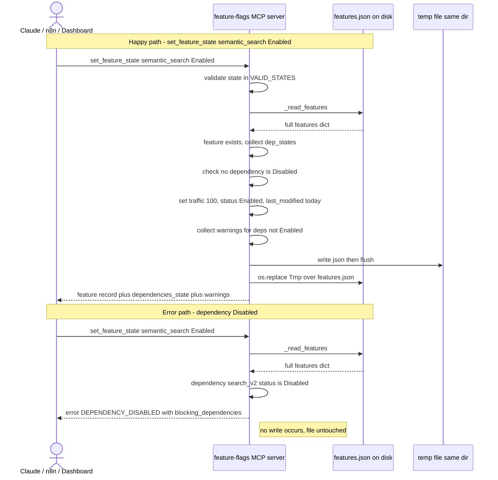

# Overview

The Feature-Flags MCP server (`mcp-servers/feature-flags/server.py`) is a Python
FastMCP service that owns read/write access to `backend/features.json`, the
single source of truth for ProShop's ~25 feature flags. Per repo convention
(`CLAUDE.md`), that JSON file must **never** be hand-edited; every mutation goes
through this server so dependency rules and the `last_modified` field stay
consistent and the Dashboard Features admin page never desyncs.

Each flag has a `status` from a three-value state model — `Disabled`, `Testing`,
`Enabled` — plus a `traffic_percentage` (0–100), `dependencies`, `name`,
`description`, `targeted_segments`, `rollout_strategy`, and `last_modified`.
Disabled implies 0% traffic; Enabled implies 100%; Testing is a canary band
where traffic typically lives in 1–99%.

The server exposes four tools. `list_features` returns a compact summary
(id, name, status, traffic, dependencies) for discovery. `get_feature_info`
returns one flag's full record plus a resolved `dependencies_state` array.
`set_feature_state` flips a flag's status: Disabled forces traffic to 0,
Enabled forces 100 but is **blocked** if any dependency is currently Disabled
(`DEPENDENCY_DISABLED`), and Testing keeps an in-band traffic value or resets to
a safe 10% canary. Moving to Testing/Enabled while a dependency is not yet
Enabled returns soft `warnings[]`. `adjust_traffic_rollout` ramps the canary
percentage but only when status is exactly `Testing`; rail values 0/100 return a
`hint` nudging the caller toward `set_feature_state`.

Writes are atomic: data is serialized to a temp file in the same directory, then
`os.replace`d over `features.json`, so concurrent readers (the Express backend)
never observe a partial file. Default transport is stdio (Claude Code via
`.mcp.json`); it can also run as HTTP/SSE for n8n. Callers therefore include
**Claude** (Claude Code agent), the **Dashboard** (Express admin page reading
the file), and **n8n** automated workflows hitting the HTTP transport.

## Decision Table

| # | Condition | Then-action | Else-action | Edge case |
|---|-----------|-------------|-------------|-----------|
| 1 | `set_feature_state` `state` not in `("Disabled","Testing","Enabled")` | Return `INVALID_STATE`, no write | Continue | Lowercase `"enabled"` is rejected (case-sensitive) |
| 2 | `feature_id` not a key in features.json (any tool) | Return `FEATURE_NOT_FOUND`, no write | Continue | Typo / stale id from cached `list_features` |
| 3 | `set_feature_state` → `Enabled` and a dependency status == `Disabled` | Return `DEPENDENCY_DISABLED` with `blocking_dependencies`, no write | Proceed to enable | Multiple blocking deps listed as array |
| 4 | `set_feature_state` → `Enabled` and all deps present and non-Disabled | Set traffic=100, status=Enabled, write | — | Dep in `Testing` allowed but adds a `warning` |
| 5 | `set_feature_state` → `Enabled`/`Testing` and a dep status != `Enabled` | Append soft `warning`, still write | No warning | Dep id missing from file is silently skipped (not in `dep_states`) |
| 6 | `set_feature_state` → `Disabled` | Set traffic=0, status=Disabled, write | — | Traffic forced to 0 even if it was 100 |
| 7 | `set_feature_state` → `Testing` and current traffic is int in 1..99 | Keep existing traffic | Reset traffic to 10 | Traffic of 0, 100, non-int, or bool → reset to 10 |
| 8 | `adjust_traffic_rollout` `percentage` not int (or is bool) | Return `INVALID_PERCENTAGE`, no write | Continue | `True` is an int subclass → explicitly rejected |
| 9 | `adjust_traffic_rollout` `percentage` < 0 or > 100 | Return `INVALID_PERCENTAGE`, no write | Continue | Pydantic `Field(ge=0, le=100)` may reject before body runs |
| 10 | `adjust_traffic_rollout` and status != `Testing` | Return `WRONG_STATUS_FOR_ROLLOUT`, no write | Set traffic, write | Cannot use this tool to "turn on" a Disabled flag |
| 11 | `adjust_traffic_rollout` writes and percentage == 0 | Write, return `hint` to use `set_feature_state('Disabled')` | hint=null | Flag parked at 0% but still nominally Testing |
| 12 | `adjust_traffic_rollout` writes and percentage == 100 | Write, return `hint` to use `set_feature_state('Enabled')` | hint=null | Flag parked at 100% but still nominally Testing |
| 13 | Any read and `features.json` does not exist at resolved path | Raise `FileNotFoundError` with PROSHOP_FEATURES_PATH guidance | Read file | Wrong env var / running from unexpected cwd |
| 14 | `get_feature_info`/`list_features` and a feature's `dependencies` key absent | Treat as `[]` (empty) | Iterate deps | `... or []` guards `null` values too |
| 15 | `_dependency_statuses` and a listed dep id not in file | Emit `{"feature_id": id, "status": "MISSING"}` | Emit real status | Dangling dependency reference |

## Sequence Diagram

## Edge Cases

- **Read–modify–write race on the JSON file.** Each tool does `_read_features` →
  mutate in memory → `_write_features`. Two writers interleaving (e.g. Claude and
  n8n) can have the second clobber the first's change (last-write-wins, lost
  update). There is no file lock or compare-and-swap.
- **Atomic write is per-write only.** `os.replace` makes each individual write
  atomic against readers, but does **not** make the read+write pair atomic, so it
  prevents partial files, not lost updates.
- **Partial / orphaned temp files.** If the process is killed between temp-file
  creation and `os.replace`, a `.features.*.tmp` file is left behind in
  `backend/`. `delete=False` means nothing cleans it up.
- **Concurrent writers over HTTP transport.** Running `--transport http/sse`
  exposes the same global, lock-free file access to multiple network clients
  simultaneously, amplifying the lost-update race versus single-client stdio.
- **Unknown / typo'd feature id.** Returns `FEATURE_NOT_FOUND` for mutate/info
  tools, but `list_features` never validates ids — a stale id discovered earlier
  can silently 404 on the next call.
- **Dependency cycles.** Nothing detects `A depends on B depends on A`. Validation
  only checks the *direct* dependency's current status; transitive chains and
  cycles are not traversed, so a cycle would not be flagged.
- **Transitive dependencies ignored.** Enabling `semantic_search` only checks
  `search_v2`; if `search_v2` itself depended on a Disabled flag, that is not
  caught. Warnings/blocks are one level deep.
- **Dangling dependency reference.** A dependency id not present in the file is
  reported as `"status": "MISSING"` by `get_feature_info`, but in
  `set_feature_state` it is filtered out of `dep_states` entirely, so it neither
  blocks nor warns — a missing dep is treated as "fine".
- **Traffic out of range / wrong type.** `adjust_traffic_rollout` guards int-ness
  and 0..100, and explicitly rejects `bool` (since `True`/`False` are int
  subclasses). But `set_feature_state` writes whatever traffic already exists
  when going to Testing if it happens to be 1..99 — it never re-validates an
  externally corrupted value outside that band beyond resetting to 10.
- **Rail values while Testing.** A flag can legitimately sit at `traffic=0` or
  `traffic=100` with `status="Testing"` (only a soft `hint` is returned),
  creating an ambiguous state the Dashboard must interpret.
- **Missing file.** If `features.json` is absent at the resolved path, every read
  raises `FileNotFoundError`; the message points to `PROSHOP_FEATURES_PATH`, but
  no tool degrades gracefully.
- **Malformed / hand-edited JSON.** `json.load` raises `JSONDecodeError` on a
  corrupt file (e.g. someone edited it directly despite the rule). The server has
  no schema validation, so a structurally-valid-but-wrong file (missing `status`,
  string traffic) passes reads and surfaces later as `KeyError`/type bugs.
- **Schema drift inside a record.** `feature["status"]` is accessed directly in
  `_dependency_statuses` (`dep["status"]`) and in `set_feature_state`
  (`features[d]["status"]`); a dependency record missing `status` raises
  `KeyError`, not a clean error object.
- **Unauthenticated network exposure.** The HTTP/SSE transport has no auth; the
  docstring suggests binding `0.0.0.0` for Docker/n8n, which exposes mutate tools
  (and the `/health` probe) to anything that can reach the port.
- **`last_modified` is date-only, no time.** Uses `date.today().isoformat()`,
  so multiple changes on the same day are indistinguishable by timestamp, and
  there is no audit trail of *who* changed a flag.
- **Path resolution depends on layout.** `FEATURES_PATH` defaults to
  `../../backend/features.json` relative to `server.py`; moving the script or
  running with an unexpected cwd silently targets the wrong (or missing) file.
- **No write-back of cleaned data.** Reads do not normalize; if traffic and
  status are inconsistent on disk (e.g. Enabled with traffic 40), only an
  explicit mutate fixes it — pure reads echo the inconsistency.

## Open Questions

- **Concurrency contract.** Is single-writer (stdio, one Claude session) the
  assumed deployment, or is the HTTP transport expected to take concurrent n8n +
  Dashboard writes? If the latter, what is the intended locking strategy? Nothing
  is documented.
- **Dashboard write path.** `CLAUDE.md` says the Dashboard Features admin page
  reads this file — does the Express backend ever *write* `features.json`
  directly (bypassing the MCP), and if so how is that reconciled with the
  "MCP-only writes" rule?
- **Dependency depth.** Is one-level dependency checking intended, or should
  Enable validation traverse the full transitive graph and detect cycles?
- **Authoritative state↔traffic invariant.** Is `Testing` with traffic 0 or 100 a
  supported state or a bug to be cleaned up? The code only hints, never enforces.
- **Auth for HTTP transport.** Is the network transport meant to run only on a
  trusted host/loopback, or should it have a token/API key? Currently none.
- **Temp-file cleanup.** Is leaving `.features.*.tmp` on crash acceptable, or
  should startup sweep stale temp files?
- **Schema ownership.** Where is the canonical schema for a feature record
  (required keys, allowed `rollout_strategy`, `targeted_segments` vocabulary)?
  The server validates none of it.
- **Who may transition what.** Are there environments (prod vs dev) or role
  checks expected before a flag can be Enabled, or is any caller fully trusted?

## Suggested Characterization Tests

- `test_list_features_returns_count_and_summary_fields`: assert `count` equals
  number of keys and each summary has exactly id/name/status/traffic/dependencies.
- `test_get_feature_info_unknown_id_returns_FEATURE_NOT_FOUND`: feeds a bogus id,
  asserts error object and that no file write happened (mtime unchanged).
- `test_get_feature_info_resolves_dependencies_state`: a flag with a dep returns
  `dependencies_state` reflecting the dep's real status.
- `test_get_feature_info_missing_dependency_marked_MISSING`: a record whose
  `dependencies` lists an absent id yields `status == "MISSING"`.
- `test_set_state_invalid_value_rejected_case_sensitive`: `"enabled"` (lowercase)
  returns `INVALID_STATE`; `"Enabled"` succeeds.
- `test_set_state_disabled_forces_traffic_zero`: enable then disable a flag, assert
  `traffic_percentage == 0`.
- `test_set_state_enabled_blocked_by_disabled_dependency`: dep Disabled →
  `DEPENDENCY_DISABLED` with correct `blocking_dependencies`, and target unchanged
  on disk.
- `test_set_state_enabled_with_testing_dependency_emits_warning`: dep in Testing →
  write succeeds, `warnings` non-empty.
- `test_set_state_testing_keeps_in_band_traffic_else_resets_to_10`: parametrize
  starting traffic {0, 5, 50, 100, "x", True} and assert reset-vs-keep behavior.
- `test_adjust_rollout_requires_testing_status`: Disabled and Enabled flags both
  return `WRONG_STATUS_FOR_ROLLOUT`; no write occurs.
- `test_adjust_rollout_rejects_bool_and_out_of_range`: `True`, `-1`, `101` each
  return `INVALID_PERCENTAGE`.
- `test_adjust_rollout_rail_values_emit_hint`: percentage 0 and 100 on a Testing
  flag write the value and return the corresponding `hint`.
- `test_atomic_write_no_partial_file_visible`: patch `os.replace` / serialization
  to assert the destination is only swapped via `os.replace`, never written
  in place; verify a temp file is created in the same directory.
- `test_missing_features_file_raises_FileNotFoundError`: point
  `PROSHOP_FEATURES_PATH` at a nonexistent file, assert the raised error message
  mentions the env var.
- `test_malformed_json_raises_decode_error`: write `"{ not json"` to the target
  and assert a read tool raises `JSONDecodeError`.
- `test_last_modified_set_to_today_on_mutation`: any successful mutate sets
  `last_modified == date.today().isoformat()`.
- `test_concurrent_writes_last_write_wins` (characterizes current behavior):
  read A, read B, write A, write B → assert B clobbers A's change (documents the
  lost-update race so a future fix is detectable).
