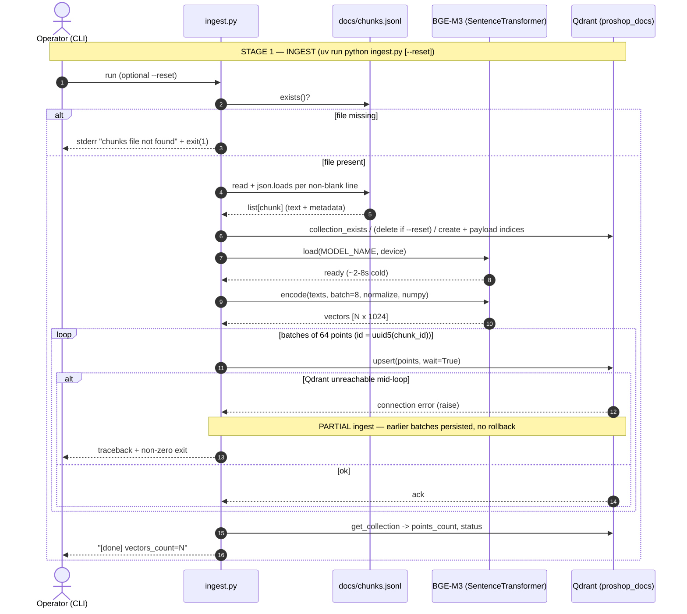

# RAG Pipeline Spec — `rag/ingest.py` + `rag/query.py`

> Reverse-engineered behavioral spec for the two-stage RAG pipeline that backs
> the **search-docs MCP** (`mcp-servers/search-docs/server.py`). Produced by the
> 4-step legacy pattern (read → decision table → sequence → edge cases →
> open questions → characterization tests). Describes *observed* behavior of the
> code as written, not aspirational behavior.

# Overview

The RAG pipeline is two independent stages sharing one Qdrant collection and one
embedding model. **Stage 1 — ingest** (`rag/ingest.py`) reads
`docs/chunks.jsonl` (471 chunks, produced per `docs/chunking-spec.md`), embeds
every chunk's `text` field with **BGE-M3** (`BAAI/bge-m3`, dense output
**1024-dim**, L2-normalized), and upserts the vectors plus payload into the
Qdrant collection `proshop_docs` (cosine distance). **Stage 2 — query**
(`rag/query.py`) embeds a single natural-language query with the same model,
runs `query_points` against the same collection (optionally filtered by `kind`),
and returns the top-K hits as plain dicts (`score`, `chunk_id`, `source_file`,
`file_path`, `kind`, `title`, `parent_headings`, `snippet`). The search-docs MCP
imports `query.search` directly and is a thin protocol adapter (no second
retrieval implementation).

**Chunk schema** (one JSON object per line): `text` (breadcrumb + section
markdown) plus a `metadata` object (`chunk_id`, `source_file`, `file_path`,
`title`, `parent_headings`, `kind`, `keywords`, `summary`, `language`,
`chunk_index`, `total_chunks_in_file`). On upsert, ingest flattens this into a
Qdrant point: `payload = {**metadata, "text": chunk["text"]}`.

**Embedding & device.** Both stages pick the device once (`mps` → `cuda` →
`cpu`) and load `SentenceTransformer(MODEL_NAME, device=...)`. Encoding uses
`normalize_embeddings=True, convert_to_numpy=True`; ingest also passes
`batch_size=BATCH_SIZE` (default 8, env `EMBED_BATCH`).

**Qdrant collection / upsert.** `ensure_collection` creates `proshop_docs`
(size 1024, cosine) if absent and adds KEYWORD payload indices on `kind`,
`source_file`, `file_path`, `language`. Points are upserted in batches of 64
with `wait=True`.

**Model caching.** Ingest loads the model once per process (it is a batch
script). Query lazily caches the model in a module-level `_MODEL` global
(`get_model()`), so a long-lived importer (the MCP server) loads BGE-M3 once.

**Idempotency.** Point IDs are `uuid5(NAMESPACE_URL, chunk_id)` — deterministic,
so re-running ingest overwrites the same points rather than duplicating. `--reset`
drops the collection first for a clean full reindex.

Config is env-driven: `QDRANT_URL` (default `http://localhost:6333`),
`QDRANT_COLLECTION` (`proshop_docs`), `EMBED_MODEL` (`BAAI/bge-m3`),
`EMBED_BATCH` (8).

## Decision Table

| # | Condition | Then-action | Else-action | Edge case |
|---|---|---|---|---|
| 1 | `docs/chunks.jsonl` does not exist (ingest) | print to stderr, `sys.exit(1)` | proceed to load | Path resolved relative to `rag/` parent; a symlink or 0-byte file passes `.exists()` but yields empty/garbage |
| 2 | A line in chunks.jsonl is blank/whitespace | skipped (`if not line: continue`) | parsed via `json.loads` | trailing newline at EOF is harmless |
| 3 | A line is malformed JSON | `json.loads` raises `JSONDecodeError`, whole run aborts | line appended | one bad line kills the entire ingest; no per-line try/except |
| 4 | Corpus is empty (0 chunks after load) | collection still created; `model.encode([])` returns empty array; 0 points upserted; `points_count=0` | normal upsert | no error raised — "successful" empty ingest can silently wipe expectations |
| 5 | Collection already exists, `--reset` not passed | reuse it, upsert overwrites by deterministic id | n/a | a collection created with a *different* dim/distance is reused as-is (no schema check) → see #8 |
| 6 | Collection exists, `--reset` passed | `delete_collection` then recreate + reindex all | create fresh if absent | window between delete and recreate: a concurrent query sees a missing collection |
| 7 | Collection absent | `create_collection` (dim 1024, cosine) + 4 payload indices | reuse existing | first ingest path |
| 8 | Embedding dim ≠ collection `VectorParams.size` (1024) | Qdrant rejects upsert with a dimension error | upsert succeeds | only happens if `EMBED_MODEL` is swapped for a non-1024 model against an existing 1024 collection |
| 9 | Model loads successfully | log `ready in Xs`, continue | n/a | cold start ~2–8 s (download + load) |
| 10 | Model fails to load (no weights / offline / OOM) | `SentenceTransformer(...)` raises, run aborts before any upsert | n/a | first run needs network to pull `BAAI/bge-m3` from HF unless cached |
| 11 | `EMBED_BATCH` env unset / invalid | default 8; non-int string → `ValueError` at `int(...)` at import | use provided int | very large batch → high peak memory (see #Edge) |
| 12 | Qdrant unreachable during upsert | `client.upsert` raises (connection error); already-sent batches persist | all batches land | **partial ingest** — collection left half-populated, no rollback |
| 13 | Query: `kind` provided | build `Filter(must=[FieldCondition(key="kind", match=...)])` | `qfilter=None` (no filter) | `query.py` does **not** validate `kind`; an unknown kind simply returns 0 hits (MCP layer validates against `VALID_KINDS`) |
| 14 | Query: `top_k` value | passed straight to `limit=top_k` | n/a | `query.py` does **not** bound `top_k`; the MCP enforces `1 ≤ top_k ≤ 25`. Direct CLI use with `top_k=0` returns no hits |
| 15 | Query: snippet text longer than `snippet_chars` (240) | truncate + `"..."`, newlines → spaces | use full text | `text` may be missing in payload → `""` snippet |
| 16 | Query: 0 hits returned | `main()` prints "No results." to stderr, `sys.exit(1)`; `search()` itself returns `[]` | format each hit | MCP returns `{"count": 0, "hits": []}` (no exit) |

## Sequence Diagram



```mermaid
sequenceDiagram
    autonumber
    participant Caller as MCP / CLI
    participant Qy as query.search()
    participant Model as BGE-M3 (cached _MODEL)
    participant Q as Qdrant (proshop_docs)

    Note over Caller,Q: STAGE 2 — QUERY
    Caller->>Qy: search(query, top_k, kind)
    Qy->>Model: get_model() (lazy; load once, cache in _MODEL)
    Model-->>Qy: model
    Qy->>Model: encode(query, normalize, numpy) -> vector[1024]
    Qy->>Q: new QdrantClient(url) per call
    opt kind provided
        Qy->>Qy: build Filter(kind == value)
    end
    Qy->>Q: query_points(vector, limit=top_k, filter, with_payload)
    alt Qdrant reachable
        Q-->>Qy: hits[] (score + payload)
        Qy->>Qy: build dicts, truncate snippet to 240 chars
        Qy-->>Caller: list[hit]  (may be [])
    else Qdrant unreachable
        Q-->>Qy: connection error (raise)
        Qy-->>Caller: exception propagates (no retry / fallback)
    end
```

## Edge Cases

- **Malformed JSONL line** — `load_chunks` has no per-line guard; a single bad
  line raises `JSONDecodeError` and aborts the whole ingest. No partial-skip,
  no line number in the message.
- **Missing required chunk keys** — `chunk["text"]` and `chunk["metadata"]` and
  `meta["chunk_id"]` are accessed by direct subscript; a chunk missing any of
  them raises `KeyError`, aborting ingest with no indication of which line.
- **Duplicate `chunk_id`s in chunks.jsonl** — both map to the same
  `uuid5(NAMESPACE_URL, chunk_id)` point id; the later one silently overwrites
  the earlier in the same run. Duplicate is masked, not detected.
- **Embedding dimension mismatch** — collection is pinned to 1024. Swapping
  `EMBED_MODEL` for a model with a different dense width against an existing
  collection makes Qdrant reject the upsert. `EMBED_DIM` is a hardcoded constant,
  not derived from the loaded model, so the two can silently diverge.
- **Qdrant down during upsert (partial state)** — upserts run in a loop of
  64-point batches with `wait=True` and no surrounding transaction. A mid-loop
  connection failure leaves the collection partially populated; the next run
  (without `--reset`) re-upserts deterministically and self-heals, but between
  runs search results are incomplete.
- **Re-ingest idempotency** — deterministic UUID5 ids mean a clean re-run
  overwrites in place (no duplication). However, **stale points are not pruned**:
  if a `chunk_id` is removed from chunks.jsonl, its vector lingers in Qdrant until
  a `--reset`. Idempotent for adds/updates, not for deletes.
- **Stale collection vs new chunks** — incremental ingest never reconciles
  deletions or `kind`/`file_path` renames at the id level (the id is derived from
  `chunk_id`, so renaming the file but keeping `chunk_id` keeps the old id; a new
  `chunk_id` creates a new point and orphans the old). Drift accumulates without
  `--reset`.
- **Model cold start (~2–8 s)** — first encode pays model download (first ever
  run, needs HF network) + load. Ingest logs the load time; query hides it inside
  the first `get_model()` call, so the first MCP query is noticeably slower than
  subsequent ones.
- **Per-call Qdrant client (perf — Stage 1 finding `rag/query.py:52`)** —
  `search()` constructs a brand-new `QdrantClient(url=QDRANT_URL)` on *every*
  call rather than caching it like the model. Under the long-lived MCP server
  this means a fresh connection setup per query — wasteful versus the cached
  `_MODEL`. Candidate for a module-level singleton mirroring `get_model()`.
- **Memory on large batches** — `model.encode` is called on the *entire* `texts`
  list at once (only the encode micro-batch is `EMBED_BATCH`); peak RSS scales
  with corpus size × token length. At 471 chunks it is fine, but a much larger
  corpus could OOM on a CPU/MPS box before any upsert happens.
- **Unicode / multilingual content** — corpus is mixed EN/RU (445 EN + 26 RU);
  files are read with `encoding="utf-8"`. BGE-M3 is multilingual so RU queries
  work. Snippet building does `text.replace("\n", " ")` only — other control
  chars and combining characters pass through; truncation at 240 chars can split
  a multi-byte grapheme cluster mid-character visually (byte safety is fine since
  it slices the decoded `str`, not bytes).
- **Empty query string** — `search("")` still embeds the empty string (valid
  1024-vector) and returns the nearest chunks by cosine to that vector; no guard
  rejects it. The MCP does not block empty `query` either.
- **`top_k` bounds** — `query.py` passes `top_k` straight to `limit` with no
  validation; `top_k=0` → empty result, negative → Qdrant error. Bounds
  (`1..25`) live only in the MCP wrapper, so direct CLI/import callers are
  unprotected.
- **`kind` filter not validated in query layer** — an unknown `kind` builds a
  valid filter that matches nothing, returning `[]` (looks like "no docs" rather
  than "bad filter"). Only the MCP rejects unknown kinds via `VALID_KINDS`.
- **`parent_headings` / `text` absent in payload** — query uses
  `.get(..., [])` / `.get("text", "")` defensively, so a point missing those
  fields yields an empty breadcrumb / snippet instead of crashing — asymmetric
  with ingest's hard subscripts.
- **Empty corpus "succeeds"** — ingest on a 0-chunk file creates/keeps the
  collection and reports `vectors_count=0` with no warning; a silently-truncated
  chunks.jsonl produces a healthy-looking but empty index.

## Open Questions

- **Stale-point reaping:** is incremental (non-`--reset`) ingest ever expected to
  delete vectors for removed `chunk_id`s, or is `--reset` the only sanctioned way
  to converge? Should ingest diff existing point ids against the new set?
- **`EMBED_DIM` source of truth:** should the 1024 constant be replaced by
  `model.get_sentence_embedding_dimension()` to prevent silent
  model/collection divergence (#8)?
- **Client reuse:** should `query.search` cache `QdrantClient` in a module global
  like `_MODEL`, and should ingest and query share a single connection helper?
- **Partial-ingest recovery:** is the self-healing-on-rerun behavior intentional,
  or should failed ingests be transactional / resumable / logged with a checkpoint?
- **Malformed-line tolerance:** should `load_chunks` skip-and-report bad lines
  (with line numbers) rather than aborting the whole batch?
- **Score / distance semantics:** consumers receive raw cosine `score` with no
  documented threshold — is there a minimum relevance cutoff the MCP should apply
  before returning hits?
- **Device determinism:** `pick_device()` (ingest) and the inline ternary
  (query) duplicate the same MPS→CUDA→CPU logic; should they share one helper, and
  is MPS numerically consistent with the CPU vectors used at ingest time?
- **Concurrency under `--reset`:** is there any guard against a query hitting the
  collection during the delete→recreate window (#6)?

## Suggested Characterization Tests

Pytest ideas using `monkeypatch` / `unittest.mock` to stub Qdrant
(`QdrantClient`) and the embedding model (`SentenceTransformer`) so tests run
without a live server or model download. These pin *current* behavior for
Stage 4 (golden-master / characterization, not aspirational).

- **`load_chunks` happy path** — write a temp `.jsonl` with 3 valid lines +
  blank lines; assert it returns 3 dicts and blanks are skipped.
- **`load_chunks` malformed line** — temp file with one non-JSON line; assert
  `json.JSONDecodeError` is raised (documents the no-skip behavior).
- **`chunk_to_point_id` determinism** — assert
  `chunk_to_point_id("features_checkout__003")` equals
  `str(uuid.uuid5(uuid.NAMESPACE_URL, "features_checkout__003"))` and is stable
  across calls (idempotency contract).
- **`ensure_collection` create path** — mock client with
  `collection_exists -> False`; assert `create_collection` called once with
  `size=1024, distance=COSINE` and `create_payload_index` called for each of
  `kind, source_file, file_path, language`.
- **`ensure_collection` reuse path** — `collection_exists -> True`, `reset=False`;
  assert neither delete nor create is called.
- **`ensure_collection` reset path** — `collection_exists -> True`, `reset=True`;
  assert `delete_collection` then `create_collection` are both called, in order.
- **ingest upsert batching** — patch model `.encode` to return a fake
  `numpy` array of shape `(130, 1024)`; patch client; run the upsert loop; assert
  `upsert` is called `ceil(130/64) == 3` times with `wait=True` and that point
  count sums to 130.
- **ingest payload shape** — assert each `PointStruct.payload` is
  `{**metadata, "text": ...}` and `id` matches `chunk_to_point_id(chunk_id)`.
- **ingest missing chunks file** — point `CHUNKS_PATH` at a nonexistent path
  (monkeypatch); assert `SystemExit(1)`.
- **`get_model` caches** — patch `SentenceTransformer`; call `get_model()` twice;
  assert the constructor is invoked exactly once (module-global cache). Reset
  `query._MODEL = None` in a fixture to isolate.
- **`search` builds kind filter** — patch model + client; call
  `search("q", kind="adr")`; assert `query_points` received a `query_filter` with
  a `kind == "adr"` `FieldCondition`; call with `kind=None` and assert
  `query_filter is None`.
- **`search` snippet truncation** — fake a hit whose `text` is 1000 chars with
  newlines; assert returned `snippet` is ≤ 243 chars, ends with `"..."`, and
  contains no `"\n"`.
- **`search` maps hit fields** — fake one hit payload; assert the output dict has
  exactly `score, chunk_id, source_file, file_path, kind, title,
  parent_headings, snippet` and that missing `parent_headings` defaults to `[]`.
- **`search` empty result** — client returns `points=[]`; assert `search` returns
  `[]` (and that `main()` would `sys.exit(1)` / print "No results.").
- **`search` new client per call (perf characterization)** — patch
  `QdrantClient`; call `search` twice; assert the constructor is called twice
  (documents the per-call-client finding at `rag/query.py:52`).
- **MCP boundary validation** — in `mcp-servers/search-docs/server.py`, call
  `search_project_docs` with `kind="bogus"` → `INVALID_KIND` dict; with
  `top_k=0` and `top_k=26` → `INVALID_TOP_K`; valid call delegates to `_search`
  and wraps result as `{query, top_k, kind, count, hits}`.
