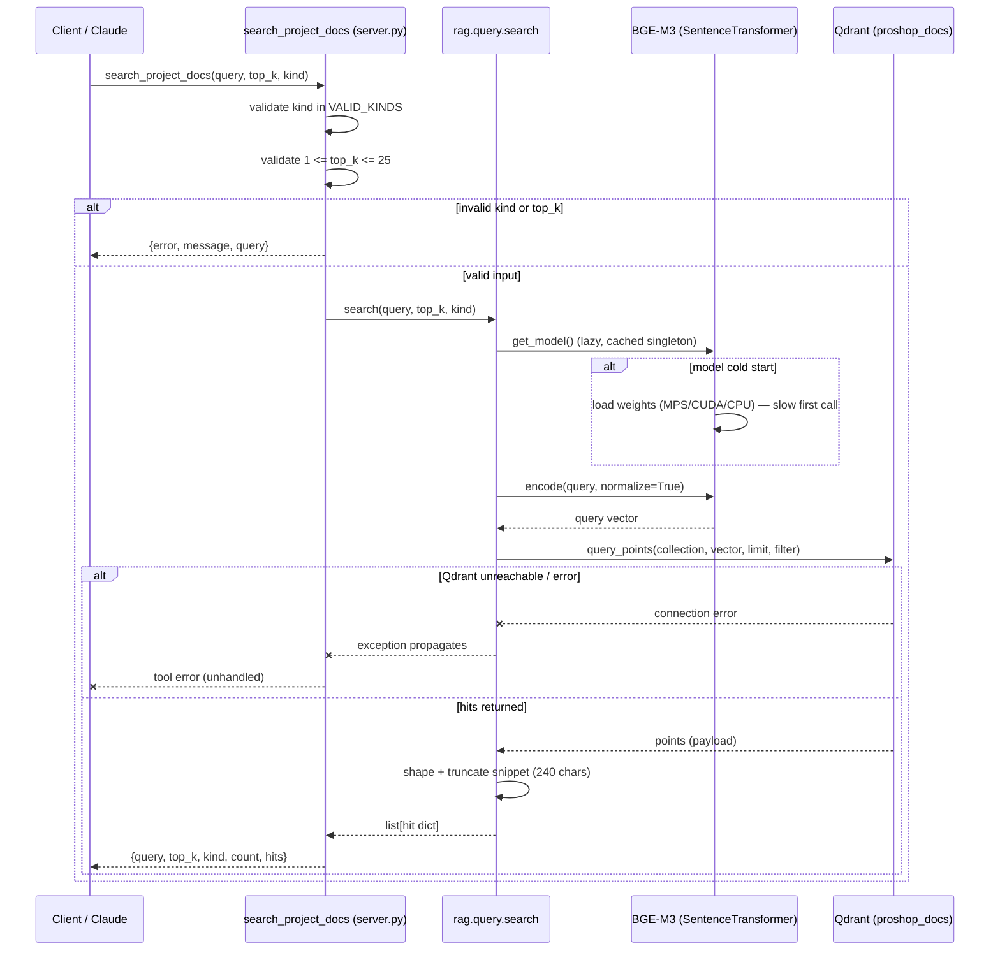

# Overview

`search-docs` is a Python MCP server (`mcp-servers/search-docs/server.py`, built on `fastmcp`) that exposes a single tool, `search_project_docs(query, top_k=5, kind=None)`, performing semantic (vector) search over the `proshop_mern` documentation corpus in `docs/project-data/`. The corpus was ingested into a Qdrant collection named `proshop_docs` (471 chunks, mixed-language: ~445 EN + ~26 RU) and embedded with the multilingual **BGE-M3** model (`BAAI/bge-m3`). The server is intentionally a *thin protocol adapter*: it does not re-implement retrieval. Instead it injects the sibling `rag/` directory onto `sys.path` at import time (`RAG_DIR = <repo>/rag`) and imports `search` from `rag/query.py`, reusing the exact retrieval, embedding, snippet-truncation, and payload-shaping logic used by the CLI.

The tool first validates inputs locally: `kind` (if provided) must be one of eleven `VALID_KINDS` (`adr`, `api`, `architecture`, `best-practice`, `feature`, `glossary`, `history`, `incident`, `page`, `runbook`, `spec`), and `top_k` must satisfy `1 <= top_k <= 25`. Invalid input returns a structured error dict (`error`, `message`, echoed args) rather than raising. On valid input it delegates to `rag.query.search`, which: lazily loads the BGE-M3 model into a module-level singleton (`get_model`, device auto-selected MPS > CUDA > CPU), encodes the query into a normalized vector, constructs a fresh `QdrantClient(url=QDRANT_URL)` per call, applies an optional `kind` field filter (`Filter(must=[FieldCondition(...)])`), and runs `query_points(collection_name="proshop_docs", limit=top_k, with_payload=True)`. Each hit is shaped into `{score, chunk_id, source_file, file_path, kind, title, parent_headings, snippet}`, where `snippet` is the chunk text with newlines collapsed and truncated to ~240 chars.

The tool returns `{query, top_k, kind, count, hits}`. Callers (Claude Code / the LLM client) use it as the **mandated first step** for any question about how the proshop_mern product works — features, architecture, ADRs, runbooks, incidents, API contracts, glossary, dev history — preferring it over `grep`/`Read` of `docs/project-data/`. It is explicitly *not* for live feature-flag state (use the feature-flags MCP) nor for verbatim full-file reads (fall back to `Read`), since the index is a frozen documentation snapshot returning snippets only.

## Decision Table

| Condition | Then-action | Else-action | Edge_case |
| --- | --- | --- | --- |
| `kind` is `None` | Skip kind validation; pass `kind=None` to `search` (no Qdrant filter) | — | Most common path; searches all 471 chunks |
| `kind` provided and in `VALID_KINDS` | Build `Filter(must=[FieldCondition(key="kind", match=MatchValue(value=kind))])` | Return `{"error":"INVALID_KIND", ...}` before any embedding/Qdrant work | `kind` is case-sensitive; `"ADR"` or `"incidents"` (plural) is rejected |
| `kind` provided but not in `VALID_KINDS` | Return `INVALID_KIND` error dict with the valid list, echo `query` | — | Fails fast, no model load, no network call |
| `top_k` within `1..25` inclusive | Proceed to `search(query, top_k=top_k, kind=kind)` | Return `{"error":"INVALID_TOP_K", ...}` | Boundaries 1 and 25 are valid; 0 and 26 are not |
| `top_k == 0` or `top_k > 25` | — | Return `INVALID_TOP_K` error dict echoing `query`, `top_k` | Guards Qdrant against pathological `limit` values |
| `top_k` negative | — | Return `INVALID_TOP_K` (fails `1 <= top_k`) | Never reaches Qdrant |
| Model not yet loaded (cold start) | `get_model()` lazily loads BGE-M3 onto best device, caches in `_MODEL` | Reuse cached `_MODEL` singleton | First call pays multi-second model-load + weight-download latency |
| Embedding succeeds | `model.encode(..., normalize_embeddings=True)` → vector | (exception propagates as tool failure) | Normalized vectors assume cosine/dot index config |
| Qdrant reachable at `QDRANT_URL` | `query_points(...)` returns `.points` | Connection error propagates up (unhandled in tool) | No retry/timeout wrapper; surfaces as raw exception to MCP client |
| Qdrant returns hits | Shape each into hit dict, `count = len(hits)` | — | Snippet truncated at 240 chars with `"..."` suffix |
| Qdrant returns zero hits (e.g. `kind` filter matches nothing) | Return `{..., "count": 0, "hits": []}` | — | Valid empty result, not an error |
| `payload` is `None` on a point | Default to `{}`; missing fields become `None`/`[]` | Use payload values | Defensive `payload or {}` and `.get()` calls |
| `query` is empty string `""` | Still embedded and searched (no length guard) | — | Returns low-signal/arbitrary nearest neighbors; not blocked |
| `query` extremely long | Embedded as-is (BGE-M3 truncates at model max seq len) | — | Silent truncation; no warning to caller |
| Collection name differs from `proshop_docs` | Uses `QDRANT_COLLECTION` env override if set | Defaults to `proshop_docs` | Misconfigured env → "collection not found" from Qdrant |

## Sequence Diagram

## Edge Cases

- **Empty query (`""`)**: not guarded — embedded and searched anyway, returning arbitrary nearest neighbors with low scores. Caller cannot distinguish "bad query" from "weak corpus match".
- **Huge query**: silently truncated by BGE-M3 at its max sequence length; no warning is surfaced, so very long questions may lose their tail intent.
- **Invalid `kind`**: rejected up front with `INVALID_KIND` before any model load or network call — cheap and correct, but case-sensitive and singular-form-only (`"incidents"`, `"ADR"`, `"Spec"` all rejected).
- **`top_k = 0` / negative**: rejected with `INVALID_TOP_K`; never reaches Qdrant.
- **`top_k` huge (e.g. 1000)**: rejected (cap is 25). The cap protects context-window dilution and Qdrant load, but a caller wanting a full dump must page manually (no offset support).
- **`top_k` boundaries**: 1 and 25 are valid; off-by-one regressions here would silently change behavior — worth a characterization test.
- **Qdrant connection failure / down**: `QdrantClient.query_points` raises and the exception propagates unhandled through `search` and the tool, surfacing as a raw MCP tool error with no structured `{error: ...}` envelope (inconsistent with the validation errors).
- **Model cold-start latency**: first call triggers `SentenceTransformer(MODEL_NAME)` load (and possibly weight download), costing seconds; this happens inside the tool call, so the first MCP request appears to hang. Subsequent calls reuse the `_MODEL` singleton.
- **Per-call `QdrantClient` construction**: `search` builds a new `QdrantClient(url=QDRANT_URL)` on every invocation rather than reusing a client — adds connection-setup overhead per query and is a latent perf/socket-churn concern under load.
- **Stale index vs corpus drift**: the Qdrant collection is a frozen snapshot built by `rag/ingest.py`. If `docs/project-data/` changes without re-ingest, snippets/`file_path`/counts (471 chunks) go stale and callers get outdated answers with no staleness signal.
- **Unicode / multilingual**: corpus is mixed EN+RU and BGE-M3 is multilingual, so Cyrillic queries work; but `snippet` collapses newlines via `replace("\n", " ")` and slices at 240 *bytes/chars* — multibyte handling is Python-str-safe but truncation can cut mid-sentence.
- **Prompt/query injection**: `query` is free text embedded verbatim; there is no sanitization, but since it only becomes a vector (never an eval/SQL/shell string), injection risk is low — the realistic risk is *content* injection in returned snippets influencing the LLM.
- **`sys.path` injection coupling fragility**: the server depends on `RAG_DIR = <repo>/rag` resolving via `Path(__file__).resolve().parent.parent.parent / "rag"`; moving either `mcp-servers/search-docs/` or `rag/` breaks the bare `from query import search` import with no graceful message. The two trees also have *separate* `.venv`s, so `rag/` deps must be importable from the MCP server's environment.
- **Missing/partial payload**: defensive `payload or {}` and `.get(...)` mean missing `chunk_id`/`title`/`parent_headings` degrade to `None`/`[]` rather than KeyError — but a partially-ingested chunk yields a hit with nulls.
- **Env misconfiguration**: `QDRANT_URL`, `QDRANT_COLLECTION`, `EMBED_MODEL` are all env-overridable; a mismatched `EMBED_MODEL` (different dim) vs the indexed vectors causes a dimension-mismatch error from Qdrant, and a wrong collection name causes "not found".
- **Zero hits with a valid `kind`**: returns `count: 0, hits: []` (not an error) — correct, but a caller may misread it as "tool broken" rather than "no docs of that kind match".

## Open Questions

- Should Qdrant/embedding failures be wrapped into the same structured `{error, message}` envelope as validation errors, instead of propagating raw exceptions? The current asymmetry makes client-side error handling inconsistent.
- Is the per-call `QdrantClient()` construction intentional (simplicity / statelessness) or an oversight? Should it be a module-level singleton like `_MODEL`?
- What is the intended re-ingest cadence, and should the tool expose index metadata (build time, chunk count, corpus hash) so callers can detect staleness?
- Should `top_k`'s upper bound (25) and the default (5) be configurable via env, or are they deliberately hard contract values mirrored in the tool description?
- Is there a timeout/retry policy expected around Qdrant, or is fail-fast acceptable for an interactive MCP tool?
- Should `kind` validation be case-insensitive and/or accept plural aliases (`incidents` → `incident`) to match the CLI's looser `--kind` arg?
- The two `.venv`s (rag vs mcp-server) — is the MCP server expected to run with `rag/`'s deps installed, and is that guaranteed by `uv --directory ... run`? What pins compatibility between them?
- Should empty/whitespace-only queries be rejected up front rather than embedded?

## Suggested Characterization Tests

Use `pytest`; mock `rag.query.search` (or the underlying `QdrantClient` and `SentenceTransformer`) so tests run without a live Qdrant or model download. Patch at the import boundary the server uses (`server._search`).

- **`test_invalid_kind_returns_error`**: call with `kind="ADR"` (wrong case) and `kind="bogus"`; assert `result["error"] == "INVALID_KIND"`, the message lists valid kinds, `query` is echoed, and `_search` is **not** called (mock asserts `not called`).
- **`test_valid_kind_passes_through`**: for each of the eleven `VALID_KINDS`, assert no error and that `_search` was called with `kind=<that kind>`.
- **`test_top_k_boundaries`**: parametrize `top_k` over `[0, 1, 25, 26, -1]`; assert `1` and `25` reach `_search`, while `0`, `26`, `-1` return `INVALID_TOP_K` and skip `_search`.
- **`test_top_k_error_echoes_args`**: assert `INVALID_TOP_K` result includes both `query` and the offending `top_k`.
- **`test_happy_path_envelope`**: mock `_search` to return two hit dicts; assert the returned envelope keys are exactly `{query, top_k, kind, count, hits}`, `count == 2`, and `hits` is passed through unchanged.
- **`test_default_top_k_is_5`**: call without `top_k`; assert `_search` received `top_k=5` and the envelope reports `top_k == 5`.
- **`test_no_hits_is_not_error`**: mock `_search` to return `[]`; assert `count == 0`, `hits == []`, and no `error` key.
- **`test_empty_query_is_passed_through`**: call with `query=""`; assert it still reaches `_search` (documents current no-guard behavior).
- **`test_snippet_truncation`** (against `rag.query.search` with mocked Qdrant points): a payload `text` > 240 chars yields a 243-char snippet ending in `"..."` with newlines collapsed to spaces.
- **`test_payload_none_defaults`** (mock a point with `payload=None`): assert the hit dict has `parent_headings == []` and other fields `None` without raising.
- **`test_kind_filter_constructed`** (mock `QdrantClient`): when `kind="incident"`, assert `query_points` was called with a `query_filter` matching `kind=incident`; when `kind=None`, assert `query_filter is None`.
- **`test_qdrant_failure_propagates`**: make `_search` raise `ConnectionError`; assert the tool currently raises (documents the unhandled-error gap — update if error wrapping is added).
- **`test_model_singleton`** (against `rag.query.get_model` with `SentenceTransformer` mocked): call twice; assert the constructor ran once and the same object is returned.
- **`test_unicode_query`**: pass a Cyrillic query (`"Какая БД используется?"`); assert it reaches `_search` unchanged (no mangling).
