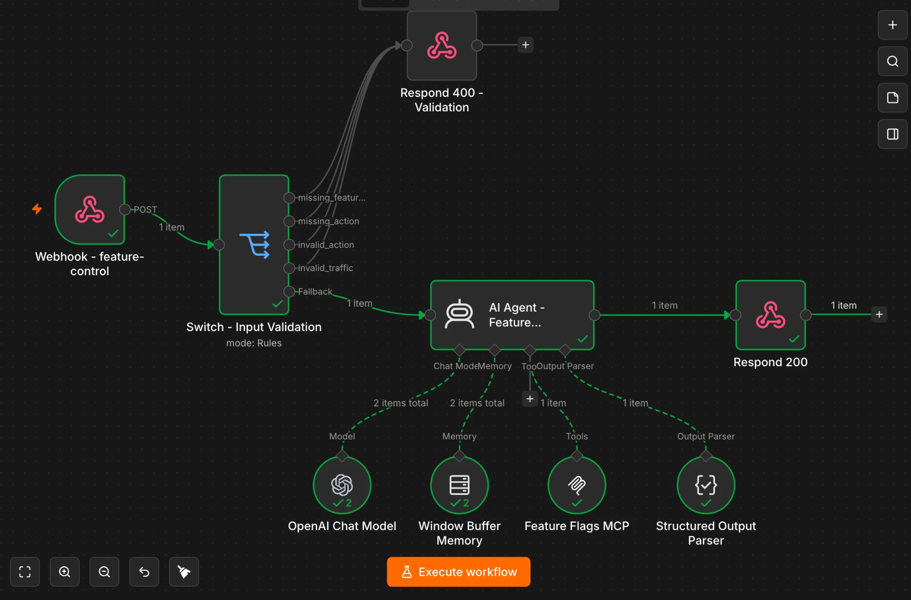

# M5 Homework — n8n Agentic Workflows

Замыкаем full-stack на `proshop_mern`: **M3 (руки / MCP)** + **M4 (глаза / Feature Dashboard)** + **M5 (мозг / AI Agent в n8n)**.

> 📋 Отчёт по модулю (по конвенции курса) — секция **`## M5`** в корневом [`report.md`](../../report.md). Этот файл — детальный runbook + результаты по папке `homework/M5/`.

## Архитектура (кратко)

Два n8n-workflow управляют feature flags через MCP-сервер из M3 (`mcp-servers/feature-flags`), который читает/пишет `backend/features.json`:

- **WF1 (manual).** Кнопки **Auto-Pilot** в Feature Dashboard (M4) шлют `POST` на webhook n8n с `X-API-Key`. Детерминированный **Switch** валидирует вход → **AI Agent (OpenAI)** через **MCP Client Tool** крутит ручки → UI получает JSON-вердикт и перечитывает источник истины (`GET /api/feature-flags`).
- **WF2 (scheduled).** Cron раз в минуту: **Code-нода** детерминированно читает `logs.json` (синусоидальный error rate от `simulate_wf2.py`) и текущий статус из `features.json` → **Switch** решает deactivate / re-enable / no-op → **AI Agent** выполняет решение через MCP и шлёт алерт в **Telegram**. За один период синусоиды видно полный цикл auto-toggling.

## Стек

| Что | Выбор | Обоснование |
|---|---|---|
| n8n | **self-host Docker (локально)** | На той же машине, что backend/MCP → логи через volume-mount, MCP через `host.docker.internal`, без туннелей. |
| Chat Model | **OpenAI `gpt-4o-mini`** — нода `lmChatOpenAi` | Надёжный tool-calling + structured output. Изначально брал Claude, но `lmChatAnthropic` на этом билде n8n 2.23.4 отдавал 400 на id модели — переключился на OpenAI. |
| Storage логов | **JSON-файл** (`logs.json`), bind-mount в контейнер | Достаточно для домашки; Postgres/Redis — в бэклоге (см. бонусы). |
| MCP transport | **SSE** (`server.py --transport sse`) | n8n MCP Client Tool подключается к `/sse`; добавлен в `server.py` (раньше был только stdio). |
| Telegram bot | `@proshop_m5_alerts_bot` | chat_id вшит в WF2 Telegram-ноду; алерты инцидентов/recovery. |

## Карта файлов

```
homework/M5/
├── README.md                    ← этот файл
├── wf1-manual-trigger.json      ← n8n workflow (импорт через Import from File)
├── wf2-scheduled-monitor.json   ← n8n workflow
├── simulate_wf1.py              ← dispatcher для WF1 (sine traffic %, --include-invalid)
├── simulate_wf2.py              ← генератор логов для WF2 (sine error rate)
├── logs.json                    ← пример событий после прогона simulate_wf2
├── docker-compose.yml           ← turnkey n8n (mounts + env) для §2 runbook
├── trace-wf1.png                ← reasoning агента (intermediateSteps + вызов get_feature_info)
├── trace-wf1-canvas.png         ← холст WF1 (вся цепочка зелёная)
└── trace-wf2-toggle.png         ← цикл алертов в Telegram (deactivate ↔ re-enable)
```
> `screencast.mp4` опущен осознанно — весь сквозной цикл задокументирован и доказан
> трейсами выше (см. «Результаты прогона»). См. «Статус сдачи» в конце.

Правки вне этой папки:
- `frontend/src/components/AutoPilotControls.js` — новый компонент (3 кнопки + rollout).
- `frontend/src/screens/FeatureDashboardScreen.js` — расширен блоком Auto-Pilot на каждую фичу.
- `frontend/.env.example` — `REACT_APP_N8N_WEBHOOK_URL`, `REACT_APP_N8N_API_KEY`.
- `mcp-servers/feature-flags/server.py` — добавлен HTTP/SSE-транспорт + `/health` + schema-валидация `percentage` (`Annotated[int, Field(ge=0, le=100)]`).

---

## ⚠️ Отличия от текста задания (осознанные)

1. **Стек фронта — CRA, не Vite.** `proshop_mern` это Create React App (React 16), поэтому env-переменные читаются как `process.env.REACT_APP_*`, а не `import.meta.env.VITE_*` из сниппетов спеки.
2. **Имена параметров MCP-инструментов.** Реальные сигнатуры: `set_feature_state(feature_id, state)` и `adjust_traffic_rollout(feature_id, percentage)` (не `target_state`/`traffic_percentage`). UI-контракт webhook остаётся как в спеке (`action`, `target_state`, `traffic_percentage`), а **агент маппит** их в реальные tool-вызовы (схему инструментов он берёт из MCP динамически). Это прописано в GCAO.
3. **WF2: чтение статуса — детерминированное, не через HTTP Request к MCP.** Спека предполагала, что MCP отдаёт REST (`POST /tools/get_feature_info`). Наш FastMCP по сети отдаёт **MCP-протокол на `/mcp` (или `/sse`)**, а не REST-роуты. Поэтому «get current status» делается **прямо в Code-ноде** (читает `features.json` из bind-mount) — это и есть Algorithm-before-AI: чтение и решение детерминированы, а **запись** (`set_feature_state`) делает агент через MCP. Нод `HTTP Request` + `Merge Data` из спеки заменены одной Code-нодой.
4. **Субагенты `n8n-requirements-orchestrator` / `n8n-workflow-builder` — placeholder'ы.** В материалах курса они помечены `status: PLACEHOLDER` («финальная версия будет добавлена автором»). Они **установлены** в `~/.claude/agents/` (требование Part D), но JSON собран по валидированной спеке D.4 + актуальным docs.n8n.io — ровно как советует сам `n8n-workflow-builder.md` («используйте general-purpose CC с n8n docs»).

---

## Runbook — как запустить

> Команды из корня репозитория, если не указано иное.

### 1. MCP-сервер из M3 по сети (SSE)

```bash
cd mcp-servers/feature-flags
uv run python server.py --transport sse --host 0.0.0.0 --port 8787
# проверка:
curl http://localhost:8787/health        # -> {"status":"ok","server":"proshop-feature-flags"}
```
`stdio` по-прежнему дефолт (`.mcp.json` для Claude Code работает без изменений).

### 2. n8n в Docker (volume-mounts + доступ к fs из Code-ноды)

```bash
docker run -d --name n8n -p 5678:5678 \
  -e NODE_FUNCTION_ALLOW_BUILTIN=fs \
  -e N8N_SECURE_COOKIE=false \
  -v "$(pwd)/homework/M5:/data/logs" \
  -v "$(pwd)/backend:/data/backend" \
  n8nio/n8n
# на Linux добавьте: --add-host=host.docker.internal:host-gateway
```
- `NODE_FUNCTION_ALLOW_BUILTIN=fs` — иначе `require('fs')` в Code-ноде заблокирован.
- `/data/logs/logs.json` ← `homework/M5/logs.json`; `/data/backend/features.json` ← `backend/features.json`.
- MCP с шага 1 доступен из контейнера как `http://host.docker.internal:8787/sse`.

### 3. MCP Client Tool node

Если ноды `MCP Client Tool` нет из коробки — Settings → Community Nodes → установить `@n8n/n8n-nodes-langchain`. Тип ноды: `@n8n/n8n-nodes-langchain.mcpClientTool`.

### 4. Импорт workflow

n8n → ⋮ → **Import from File** → `wf1-manual-trigger.json`, затем `wf2-scheduled-monitor.json`. После импорта проверьте sub-node-связи у AI Agent (`ai_languageModel`, `ai_memory`, `ai_tool`, `ai_outputParser`).

### 5. Credentials (placeholders в JSON → заменить на свои)

| Credential | Где | Значение |
|---|---|---|
| **Header Auth** (`X-API-Key`) | Webhook-нода WF1 | `openssl rand -hex 32` |
| **OpenAI API** | оба Chat Model | ключ OpenAI (модель `gpt-4o-mini`) |
| **Telegram API** | Telegram-нода WF2 | токен от @BotFather; chat_id в `getUpdates` |
| **MCP Client Tool** | обе MCP-ноды | SSE Endpoint `http://host.docker.internal:8787/sse`, Authentication = None |

Замените `{{YOUR_TELEGRAM_CHAT_ID}}` в WF2 Telegram-ноде на свой chat_id.

### 6. Фронт

```bash
cp frontend/.env.example frontend/.env
# REACT_APP_N8N_WEBHOOK_URL=http://localhost:5678/webhook
# REACT_APP_N8N_API_KEY=<тот же X-API-Key>
npm run dev    # backend :5000 + CRA :3000
```
Открыть `/admin/featuredashboard` (нужен admin), раскрыть **Auto-Pilot** на фиче.

### 7. Симуляторы

```bash
# WF2: фоновый генератор логов (период 120s -> ~2 цикла toggle за 10 мин)
python3 homework/M5/simulate_wf2.py --output homework/M5/logs.json --duration 600 --period 120 &

# WF1: dispatcher (+ тест галлюцинаций каждый 7-й запрос)
N8N_API_KEY="<X-API-Key>" python3 homework/M5/simulate_wf1.py \
  --webhook-url "http://localhost:5678/webhook/feature-control" \
  --duration 120 --interval 10 --include-invalid
```

---

## WF1 — Manual trigger

- **Webhook:** `POST http://localhost:5678/webhook/feature-control`, auth `X-API-Key` (Header Auth).
- **Что нового в Dashboard:** кнопка **Auto-Pilot** на каждой фиче раскрывает панель с 3 действиями — `check` / `test` (→ Testing) / `rollback` (→ Disabled) — и rollout-инпутом (`adjust_traffic_rollout`, требует Testing). На успех показывается сообщение агента (`alert-success`), на отказ — `alert-danger`; карточка перечитывает `/api/feature-flags`.
- **Цепочка:** Webhook → Switch (валидация) → AI Agent (OpenAI `gpt-4o-mini` + Window Buffer Memory `sessionKey={{ $json.body.feature_id }}` + MCP Client Tool + Structured Output Parser, `maxIterations=5`) → Respond 200 `{success, message, current_state, rejected_at}`.

## WF2 — Scheduled monitor

- **Threshold deactivate = 5%**, **re-enable = 1%** (как в спеке; гистерезис между порогами гасит дребезг).
- **Logs storage:** `logs.json` (bind-mount `/data/logs`). Статус читается из `features.json` (bind-mount `/data/backend`).
- **Sine period симулятора:** 300s по умолчанию (для демо 120s).
- **Цепочка:** Schedule (1 мин) → Code (error_rate за 60s + current_status) → Switch (deactivate / reenable / fallback→NoOp) → Set Decision (×2) → Monitor Agent (OpenAI `gpt-4o-mini` + MCP, **без Memory** — cron stateless, `maxIterations=3`) → Telegram. Telegram подключён **только** к main AI Agent → на no-op молчит.

## Тест на галлюцинации (Algorithm-before-AI)

`POST {feature_id:"search_v2", action:"rollout", traffic_percentage:-50}` отвергается **до LLM**:

```bash
curl -X POST http://localhost:5678/webhook/feature-control \
  -H "Content-Type: application/json" -H "X-API-Key: <key>" \
  -d '{"feature_id":"search_v2","action":"rollout","traffic_percentage":-50}'
# -> 400 {"success":false,"message":"Validation error...","rejected_at":"input-validation"}
```

**Где живёт guard (defense in depth):**
1. **Switch-нода WF1** — правило `invalid_traffic`: `traffic_percentage < 0 || > 100` → Respond 400. Невалидный ввод **не доходит до LLM** (дешёвый детерминированный guard впереди дорогого вызова).
2. **JSON Schema в MCP M3** — `adjust_traffic_rollout(percentage: Annotated[int, Field(ge=0, le=100)])` + runtime-проверка `percentage < 0 or > 100` → `INVALID_PERCENTAGE`. «Ремни безопасности», если Switch почему-то не отработал.

Constraint в промте — лишь третий, рекомендательный слой. `simulate_wf1.py --include-invalid` шлёт `-50` каждый 7-й запрос — в логах видно отказы.

## Результаты прогона (live, n8n 2.23.4 в Docker)

Окружение: MCP M3 по SSE на `:8787`, n8n 2.23.4 (Docker + mounts), Chat Model **OpenAI gpt-4o-mini**.

### WF1 — manual trigger ✅ (полная цепочка UI → n8n → AI Agent → MCP)

| Кейс | Запрос | Результат |
|---|---|---|
| Auth | POST без `X-API-Key` | `HTTP 403` — `Authorization data is wrong!` |
| **Галлюцинация** | `action=rollout, traffic_percentage=-50` | `HTTP 400` → `rejected_at: input-validation` (отбито на Switch, **до LLM**) |
| check | `action=check` | `200` → `status=Testing, traffic=25` (реальные данные из MCP) |
| rollback | `action=rollback` | `200` → `status=Disabled, traffic=0` (запись через MCP) |
| test | `action=test` | `200` → `status=Testing, traffic=10` |
| rollout 25 | `action=rollout, traffic_percentage=25` | `200` → `status=Testing, traffic=25` (восстановлено) |

Полный ответ агента на `check` (агент сам вызвал `get_feature_info` через MCP):
```json
{
  "success": true,
  "message": "Текущее состояние фичи успешно получено.",
  "current_state": { "id": "search_v2", "name": "New Search Algorithm",
    "status": "Testing", "traffic_percentage": 25, "last_modified": "2026-05-11" },
  "rejected_at": null
}
```

Трейс выполнения — холст (вся цепочка зелёная) и reasoning агента (`intermediateSteps`: вызов `Feature_Flags_MCP_get_feature_info` через MCP):




### Тест на галлюцинации — лог отказа
```
$ curl -X POST http://localhost:5678/webhook/feature-control \
    -H "Content-Type: application/json" -H "X-API-Key: <key>" \
    -d '{"feature_id":"search_v2","action":"rollout","traffic_percentage":-50}'
HTTP 400
{"success":false,"message":"Validation error: invalid request parameters","rejected_at":"input-validation"}
```
Сработал **слой 1** (Switch-нода, до AI Agent). Слой 2 — `Field(ge=0, le=100)` + runtime-проверка в MCP `adjust_traffic_rollout`. Промт — лишь третий, рекомендательный слой.

### WF2 — scheduled monitor ✅ (полный цикл auto-toggling)

Cron раз в минуту, `simulate_wf2.py --period 180`. Наблюдаемый таймлайн `search_v2`
(вотчер по `backend/features.json`, который пишет MCP):

```
17:07:32  → Disabled / 0%    деактив #1  (error_rate > 5%)   → Telegram 🚨
17:08:37  → Enabled / 100%    восстановление #1 (error_rate < 1%)  → Telegram ✅
17:10:30  → Disabled / 0%    деактив #2  (цикл повторился на следующем подъёме синусоиды)
```

Telegram-алерты 🚨 (деактивация) и ✅ (восстановление) **получены** (подтверждено).
Агент успешно записал состояние через MCP `set_feature_state` на каждом срабатывании —
вся цепочка `Schedule → Code → Switch → AI Agent → MCP → Telegram` работает, цикл
повторяемый. На no-op-тиках (error_rate в норме) Telegram молчит.


## CC-агенты (Part D)

`n8n-requirements-orchestrator` и `n8n-workflow-builder` установлены в `~/.claude/agents/` (`ls ~/.claude/agents | grep n8n` → 2 файла). В материалах курса они помечены `PLACEHOLDER`, поэтому JSON собран по валидированной спеке D.4 + актуальным docs.n8n.io (типы нод/`typeVersion` сверены: `mcpClientTool@1`, `lmChatOpenAi@1.2`, `agent@3`, `switch@3`).

## Как запустить (TL;DR)

```bash
# 1. MCP по SSE
( cd mcp-servers/feature-flags && uv run python server.py --transport sse --host 0.0.0.0 --port 8787 ) &
# 2. n8n (см. Runbook §2) + импорт обоих workflow + credentials
# 3. фронт
cp frontend/.env.example frontend/.env && npm run dev
# 4. симуляторы
python3 homework/M5/simulate_wf2.py --output homework/M5/logs.json --duration 600 --period 120 &
N8N_API_KEY="<key>" python3 homework/M5/simulate_wf1.py --webhook-url "http://localhost:5678/webhook/feature-control" --include-invalid
```

## Что было сложно

- MCP из M3 умел только **stdio** — n8n по сети к нему не достучаться. Добавил выбор транспорта (`--transport sse|http`) + `/health`, сохранив stdio по умолчанию.
- Спека предполагала **REST у MCP** для WF2, но FastMCP по сети отдаёт MCP-протокол. Перенёс чтение статуса в детерминированную Code-ноду (`features.json`), оставив агенту только запись — заодно чище по Algorithm-before-AI.
- **Гибрид Tools Agent + Structured Output Parser** конфликтен (агент хочет звать tool, а parser требует финальный JSON) — в GCAO явно прописан финальный JSON по схеме.
- Сниппеты спеки под **Vite**, проект — **CRA**: env-переменные и `import.meta` пришлось адаптировать.
- **Webhook кладёт тело в `$json.body`, не в `$json`.** Switch с `{{ $json.feature_id }}` (как в спеке A.4) ловил правилом `missing_feature_id` вообще всё — и валидный `check`, и `-50` (последний «проходил тест» по ложной причине). Починка: все ссылки на тело в WF1 → `$json.body.*`.
- **AI Agent + Structured Output кладёт результат в корень `$json`, а не под `.output`** (на n8n 2.23.4). Respond возвращал пусто. Сделал маппинг устойчивым: `{{ $json.output ?? $json }}`.
- **`lmChatAnthropic` отдавал «Bad request» на id модели** на этом билде → агент падал без финального item. Переключился на **OpenAI `gpt-4o-mini`** — заработало сразу. Урок: модель — это тоже параметр, который надо проверять по логам, а не по UI.

## Статус сдачи

| Артефакт | Статус |
|---|---|
| README с результатами (этот файл) | ✅ |
| `wf1-manual-trigger.json` / `wf2-scheduled-monitor.json` | ✅ проверены вживую (n8n 2.23.4) |
| `simulate_wf1.py` / `simulate_wf2.py` | ✅ |
| `logs.json` (пример) | ✅ |
| `trace-wf1.png` (+ `trace-wf1-canvas.png`) | ✅ |
| `trace-wf2-toggle.png` | ✅ |
| Тест на галлюцинации (Switch + JSON Schema) | ✅ отбито на Switch, до LLM |
| Субагенты в `~/.claude/agents/` (Part D) | ✅ 2 файла |
| `screencast.mp4` | ⏭️ опущен осознанно — сквозной цикл доказан трейсами (reasoning агента WF1, цепочка на холсте, Telegram-цикл WF2) |

## Бонусы (не делал — для портфолио)

- [ ] HITL Wait-нода перед деактивацией (Appendix E).
- [ ] Langfuse / LangSmith трейсинг.
- [ ] Multi-agent supervisor + worker.
- [ ] Deploy через n8n MCP (Промпт 3).
- [ ] Persistent state в Postgres вместо JSON.
