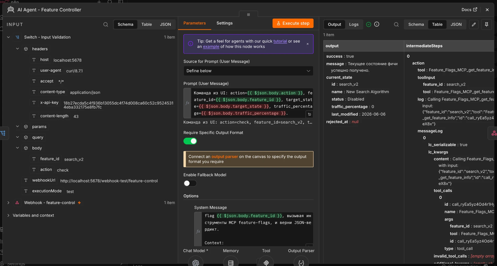
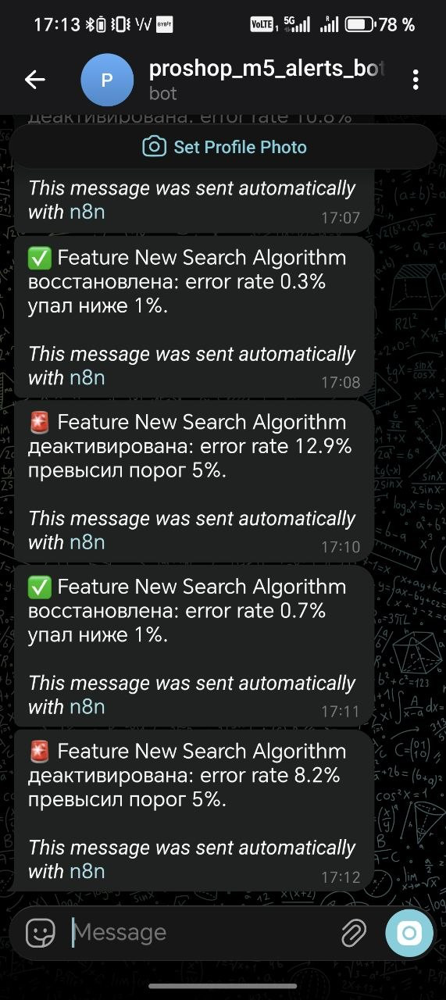

# Отчёт о работе

## Окружение

- Основная IDE: VS Code + Claude

## CLAUDE.md

- Добавил `CLAUDE.md` в корень репозитория
- Добавил правило работы в репозитории через Git
- Добавил правило по диагностике проблем по логам

## README

- Добавил описание получения `PAYPAL_CLIENT_ID`
- Добавил раздел о локальном запуске MongoDB
- Внёс правки в README по запуску сервиса — на основе проблем, с которыми столкнулся сам

## FINDINGS.md

- Проанализировал проблемы и добавил в файл 
- Исправил проблему №1

## Mermaid

- Добавил диаграмму С4

---

## M3

- **MCP framework:** Python, FastMCP
- **Сервер:** `mcp-servers/feature-flags/server.py` — 4 tools (`list_features`, `get_feature_info`, `set_feature_state`, `adjust_traffic_rollout`).
- **Источник для фичей:** `backend/features.json` (скопирован из `aidev-course-materials/M3/project-data/features.json`). MCP-сервер мутирует файл атомарно (`tempfile` + `os.replace`).
- **REST:** `GET /api/feature-flags` и `GET /api/feature-flags/:name` (`backend/routes/featureFlagsRoutes.js`, `backend/controllers/featureFlagsController.js`) — читают файл с диска на каждый запрос, без кеширования. Изменения через MCP видны фронту без рестарта backend.
- **Frontend:** новая страница `frontend/src/screens/FeatureFlagListScreen.js`, маршрут `/admin/feature-flags`, ссылка в дропдауне `Admin → Dashboard Features`, Redux-слайс `featureFlagList` (constants / action / reducer / store).

### Feature flags MCP — тестовый сценарий

**Setup:** перед сценарием сбросил `search_v2` в `Disabled`, чтобы лог покрыл все 3 обязательных tool calls (текущий дефолт в `features.json` — `Testing/15%`).

```
set_feature_state(feature_id="search_v2", state="Disabled")
-> status="Disabled", traffic_percentage=0, last_modified="2026-05-11", warnings=[]
```

**Сценарий (`search_v2`: Disabled → Testing → 25% → подтверждение):**

#### 1. `list_features` *(рекомендуемый discovery-tool)*

```
args: {}
result:
{
  "count": 25,
  "features[search_v2]": {
    "feature_id": "search_v2",
    "name": "New Search Algorithm",
    "status": "Disabled",
    "traffic_percentage": 0,
    "dependencies": []
  }
}
```

#### 2. `get_feature_info` — стартовое состояние

```
args: {"feature_id": "search_v2"}
result:
{
  "feature_id": "search_v2",
  "name": "New Search Algorithm",
  "status": "Disabled",
  "traffic_percentage": 0,
  "last_modified": "2026-05-11",
  "targeted_segments": ["beta_users", "internal"],
  "rollout_strategy": "canary",
  "dependencies_state": []
}
```

#### 3. `set_feature_state` → Testing

```
args: {"feature_id": "search_v2", "state": "Testing"}
result:
{
  "feature_id": "search_v2",
  "status": "Testing",
  "traffic_percentage": 10,   // canary-default при переходе из Disabled
  "last_modified": "2026-05-11",
  "dependencies_state": [],
  "warnings": []
}
```

#### 4. `adjust_traffic_rollout` → 25

```
args: {"feature_id": "search_v2", "percentage": 25}
result:
{
  "feature_id": "search_v2",
  "status": "Testing",
  "traffic_percentage": 25,
  "last_modified": "2026-05-11",
  "hint": null
}
```

#### 5. `get_feature_info` — подтверждение финального состояния

```
args: {"feature_id": "search_v2"}
result:
{
  "feature_id": "search_v2",
  "status": "Testing",
  "traffic_percentage": 25,
  "last_modified": "2026-05-11",
  "dependencies_state": []
}
```

**Итог:** `search_v2` переведён из `Disabled` в `Testing` с трафиком `25%`, `last_modified` обновился на сегодняшнюю дату, файл `backend/features.json` мутирован атомарно. REST-endpoint `GET /api/feature-flags/search_v2` параллельно отдаёт ровно то же состояние без рестарта backend (проверено отдельным curl-вызовом во время разработки).

---

### RAG над документацией — Часть 2

#### Stack

- **Vector DB:** Qdrant 1.18, локально в Docker на `http://localhost:6333`. Коллекция `proshop_docs`: 1024 dim, COSINE distance, payload indexes по `kind` / `source_file` / `file_path` / `language` (всё типа `keyword` под equality-фильтры).
- **Embedding:** `BAAI/bge-m3` через `sentence-transformers` 5.5.0, dense-only (1024-dim). Multilingual, MIT, бесплатно, локально. Запущена на MPS (Apple Silicon GPU).
- **Chunking:** уже нарезано в [`docs/chunks.jsonl`](./docs/chunks.jsonl) (471 чанк, ~739 KB; полный отчёт о chunking pipeline — в [`docs/report.md`](./docs/report.md)). 11 типов: runbook, feature, api, best-practice, architecture, spec, incident, glossary, adr, history, page. Языки: 445 EN + 26 RU.
- **Scripts:** [`rag/ingest.py`](./rag/ingest.py) (BGE-M3 + Qdrant upsert, флаг `--reset` для full reindex) и [`rag/query.py`](./rag/query.py) (CLI поиска с опциональным `--kind` фильтром).
- **Управление зависимостями:** `uv` (тот же tool, что для MCP сервера в Части 1).

#### Метаданные в payload (на каждый вектор)

Все поля чанка из `docs/chunks.jsonl` сохраняются в Qdrant payload без потерь — плюс сам `text`. Покрывают и требования задания (`source_file`, `type`), и больше:

| Поле | Тип | Назначение |
|---|---|---|
| `text` | string | Содержимое чанка (для возврата в snippet и для LLM в Части 3) |
| `chunk_id` | string | Стабильный ID вида `<kind>_<filename>__<index>` (используется для UUID5 point.id — upsert идемпотентен) |
| `source_file` | string | Имя файла, e.g. `adr-001-mongodb-vs-postgres.md` ← **обязательно по заданию** |
| `file_path` | string | Полный относительный путь от `docs/project-data/`, e.g. `adrs/adr-001-mongodb-vs-postgres.md` |
| `kind` | string | Тип документа: `adr` / `api` / `feature` / `incident` / `runbook` / `page` / `spec` / `architecture` / `history` / `glossary` / `best-practice`. **Это и есть `type` из задания** — в нашем chunking spec поле названо `kind` (терминология автора), семантика идентична. Используется в payload index для фильтрации |
| `title` | string | H1 файла, e.g. `"ADR-001: Use MongoDB..."` |
| `parent_headings` | string[] | Breadcrumbs H2/H3 цепочки, e.g. `["3. Major Decisions", "Decision 1: MongoDB over PostgreSQL"]` |
| `keywords` | string[] | 3-7 ключевых слов из чанка |
| `summary` | string | 1-предложение summary |
| `language` | string | `en` / `ru` (определено per-chunk) |
| `chunk_index` | int | Порядковый номер чанка в файле |
| `total_chunks_in_file` | int | Сколько всего чанков в этом файле |

#### Воспроизводимость

```bash
# 1. Qdrant — один контейнер
docker run -d -p 6333:6333 -v $(pwd)/qdrant_storage:/qdrant/storage qdrant/qdrant:1.18.0

# 2. Установить deps RAG-проекта
cd rag && uv sync

# 3. Ingest (qdrant должен быть запущен; BGE-M3 ~2.3 GB при первом запуске)
uv run python ingest.py --reset

# 4. Прогнать запрос
uv run python query.py "Какая БД используется в proshop_mern?" --top-k 5
uv run python query.py "checkout incident" --kind incident   # с фильтром по типу
```

Полный ingest 471 чанка занял 6 минут на M-чипе через MPS (первый батч ~5 мин — прогрев Metal shaders, дальше ~4 it/s). Точек в коллекции: **471/471** (`status=green`).

#### 3 тестовых запроса

##### Запрос 1: «Какая БД используется в proshop_mern и почему именно она?»

| # | score | kind | file_path / heading | observation |
|---|---|---|---|---|
| 1 | 0.6599 | best-practice | `best-practices.md` → `1. Introduction: Why proshop_mern Is Deprecated` | общее введение про MERN-стек |
| 2 | 0.6579 | architecture | `architecture.md` → `1. System Overview` | «MongoDB, Express, React, Node» в первом абзаце |
| 3 | 0.6508 | history | `dev-history.md` → `Phase 0 — Prototype` | январь 2023, выбор стека |
| 4 | 0.6307 | history | `dev-history.md` → `3. Major Decisions > Decision 1: MongoDB over PostgreSQL` | **прямой ответ «почему» — в топ-4, не в топ-1** |
| 5 | 0.6217 | architecture | `architecture.md` → `Known Technical Debt` | JWT / Mongoose замечания |

ADR-001 (формальный архитектурный аргумент за MongoDB) и dev-history Decision 1 — это прямые ответы на «почему», но обе всплыли ниже общих обзорных чанков. Запрос на русском, корпус преимущественно EN — модель BGE-M3 справилась, но **общий вопрос на смешанном языке магнитит на общие чанки**. Hybrid search + reranker поднимет точные ответы выше.

##### Запрос 2: «Какие фичи зависят от search_v2?»

| # | score | kind | file_path / heading | observation |
|---|---|---|---|---|
| 1 | 0.6988 | spec | `feature-flags-spec.md` → `Search & Discovery → search_v2` | описание самого `search_v2`, не зависимых |
| 2 | 0.5788 | spec | `feature-flags-spec.md` → `Example Feature Object` | JSON-пример с полем `dependencies` |
| 3 | 0.5746 | spec | `feature-flags-spec.md` → `Search & Discovery` (продолжение) | rollout-стратегия search_v2 |
| 4 | 0.5740 | feature | `features-analysis-ru.md` → `3. Полная таблица 25 фичей` | **сводная таблица с колонкой dependencies — найдёт всё** |
| 5 | 0.5637 | feature | `features/catalog.md` → `Feature 2: Product Search` | legacy regex search (предшественник) |

Ожидаемый «золотой» chunk — описание `semantic_search` (с полем `dependencies: ["search_v2"]`) — не попал в топ-5. Модель магнитит на «search_v2» само по себе, а не на «зависит от». 

##### Запрос 3: «Что случилось во время последнего incident с checkout?»

| # | score | kind | file_path / heading | observation |
|---|---|---|---|---|
| 1 | 0.6426 | runbook | `runbooks/incident-response.md` → `Phase 6: Customer Communication` | общий шаблон, не конкретный incident |
| 2 | 0.5998 | runbook | `runbooks/incident-response.md` → `Phase 7: Postmortem` | пример постмортема включает PayPal outage |
| 3 | 0.5765 | incident | `incidents/i-001-paypal-double-charge.md` → `Timeline` | **прямой ответ — в топ-3** |
| 4 | 0.5714 | runbook | `runbooks/incident-response.md` → `Phase 1: Discovery` | общая фаза incident response |
| 5 | 0.5623 | spec | `feature-flags-spec.md` → `Checkout → express_checkout` | про feature flag, не про incident |

Правильный incident (`i-001-paypal-double-charge.md`, влияет на checkout flow через дублирование заказа) — топ-3. Runbook про incident response забивает топ-2 чисто за счёт лексического совпадения «incident». 


Стек выбран по двум требованиям: (1) корпус смешанный RU+EN, OpenAI 3-small отпадает (MIRACL 44 vs BGE-M3 67.8 на русском); (2) хотелось обойтись без managed API и ключей — BGE-M3 через `sentence-transformers` это даёт «из коробки». Qdrant локально через Docker — наиболее быстрая инфраструктура: один контейнер, dashboard в браузере

**Что было сложно.** Первый запуск ingest упал из-за памяти при batch_size=16 — компьютер перезагрузился. Уменьшил до 8, повторно запустил — упёрся в долгий прогрев MPS (первый батч ~5 минут), потом всё разогналось до 4 it/s. Полный ingest 471 чанка занял 6 минут.

---

### Search-docs MCP — Часть 3

[`.mcp.json`](./.mcp.json) — добавлен блок `search-docs` рядом с `feature-flags`.

[`CLAUDE.md`](./CLAUDE.md) → секция «MCP servers wired in this repo» — `search_project_docs` FIRST для любых вопросов про продукт, fallback на `Grep`/`Read` только если vector miss или нужен полный файл.

#### Запрос 1 — «Какая БД используется в proshop_mern и почему именно она?»

```
search_project_docs(query="Какая БД используется в proshop_mern и почему именно она?", top_k=5)
```

| # | score | kind | file_path | parent_headings |
|---|---|---|---|---|
| 1 | 0.6599 | best-practice | `best-practices.md` | 1. Introduction: Why proshop_mern Is Deprecated |
| 2 | 0.6579 | architecture | `architecture.md` | 1. System Overview |
| 3 | 0.6508 | history | `dev-history.md` | 1. Project Timeline → Phase 0 — Prototype |
| 4 | 0.6307 | history | `dev-history.md` | 3. Major Decisions → **Decision 1: MongoDB over PostgreSQL** |
| 5 | 0.6217 | architecture | `architecture.md` | 10. Architectural Decisions → Known Technical Debt |

**Ответ агента (на основе чанков):** Используется **MongoDB** в составе MERN-стека (chunks #1, #2, #3 — все говорят про MongoDB + Express + React + Node). «Почему» — chunk #4 (`dev-history.md` → Decision 1: MongoDB over PostgreSQL, январь 2023): выбор сделан в фазе прототипа из-за гибкой схемы Mongoose, отсутствия требования к ACID-транзакциям на старте и того, что Brad Traversy и большинство туториалов в 2022–2023 использовали именно MongoDB. Chunk #5 фиксирует технический долг: JWT в localStorage и тонкие места Mongoose-схемы — это уже про последствия выбора.

#### Запрос 2 — «Какие фичи зависят от search_v2?»

```
search_project_docs(query="Какие фичи зависят от search_v2?", top_k=5)
```

| # | score | kind | file_path | parent_headings |
|---|---|---|---|---|
| 1 | 0.6988 | spec | `feature-flags-spec.md` | 4. Feature Flag Catalog → Search & Discovery |
| 2 | 0.5788 | spec | `feature-flags-spec.md` | 2. The `features.json` Format → Example Feature Object |
| 3 | 0.5746 | spec | `feature-flags-spec.md` | 4. Feature Flag Catalog → Search & Discovery (continuation) |
| 4 | 0.5740 | feature | `features-analysis-ru.md` | 3. Полная таблица 25 фичей |
| 5 | 0.5637 | feature | `features/catalog.md` | Feature 2: Product Search |

**Ответ агента:** Прямого «обратного индекса зависимостей» в spec нет. Зато chunk #4 (`features-analysis-ru.md`, «Полная таблица 25 фичей») — это сводная таблица всех 25 фичей с колонкой `dependencies`. По ней (а также по cross-check с runtime через `feature-flags` MCP `list_features`) на `search_v2` завязана **одна** фича: **`semantic_search`** (Semantic Vector Search) — её поле `dependencies = ["search_v2"]`, новый алгоритм добавляет векторное сходство поверх legacy regex-поиска и не имеет смысла без `search_v2`. Chunk #1 описывает сам `search_v2`, не зависящих от него — vector search «магнитит» на терм `search_v2`, а не на «зависят от».

#### Запрос 3 — «Что случилось во время последнего incident с checkout?»

```
search_project_docs(query="Что случилось во время последнего incident с checkout?", top_k=5, kind="incident")
```

Фильтр `kind="incident"` — категория ответа известна сразу, payload index по `kind` отрабатывает на стороне Qdrant.

| # | score | kind | file_path | parent_headings |
|---|---|---|---|---|
| 1 | 0.5765 | incident | `incidents/i-001-paypal-double-charge.md` | Timeline |
| 2 | 0.5500 | incident | `incidents/i-001-paypal-double-charge.md` | Root Cause Analysis |
| 3 | 0.5467 | incident | `incidents/i-002-mongo-connection-pool-exhaustion.md` | Summary |
| 4 | 0.5439 | incident | `incidents/i-001-paypal-double-charge.md` | Resolution |
| 5 | 0.5322 | incident | `incidents/i-001-paypal-double-charge.md` | Summary |

**Ответ агента:** Последний инцидент в checkout — **i-001 PayPal Sandbox Webhook Double-Charge** (4 чанка из 5 — этот файл). По чанкам:
- *Summary* (#5): часть PayPal-заказов помечалась как paid дважды → дублирование `paymentResult`-документов, в трёх случаях — двойное списание со склада.
- *Timeline* (#1): 2023-11-03 21:14 — PayPal sandbox подтверждает оплату, через 2 секунды backend получает второй вебхук с тем же payment_id.
- *Root Cause* (#2): SDK `@paypal/react-paypal-js` дёргает `onApprove` дважды при определённых retry-сценариях; handler `payOrder` не делал проверку идемпотентности.
- *Resolution* (#4): добавили guard в backend handler — если `order.isPaid` уже `true`, второй вызов возвращает существующий результат без повторной записи.

Параллельно поднялся `i-002 MongoDB Connection Pool Exhaustion` (Black Friday 2023) — он чек-аут затрагивал только косвенно (полный outage), поэтому остался в одной позиции.

---

### End-to-end (search-docs + feature-flags) — Часть 3

Сценарий из задания: найти описание `semantic_search` и её зависимости через **search-docs MCP**, проверить runtime через **feature-flags MCP**, при условии «Disabled + зависимости не-Disabled» перевести в Testing + 25%, процитировать «зачем фича нужна».

#### 1. `search_project_docs` — найти описание + зависимости

```
search_project_docs(query="semantic_search feature dependencies vector embeddings", top_k=4, kind="spec")
```

| # | score | chunk_id | file_path |
|---|---|---|---|
| 1 | 0.6132 | feature-flags-spec__015 | `feature-flags-spec.md` → Search & Discovery |
| 2 | 0.5569 | feature-flags-spec__008 | `feature-flags-spec.md` → Example Feature Object |
| 3 | 0.4843 | feature-flags-spec__016 | `feature-flags-spec.md` → Search & Discovery (continuation) |
| 4 | 0.4748 | feature-flags-spec__020 | `feature-flags-spec.md` → Catalog & Discovery (product_recommendations) |

Из чанка #1 и описания в `features.json` (синхронизировано со spec) видно: `semantic_search` — Semantic Vector Search, добавляет embedding-based similarity поверх keyword-поиска, требует `search_v2` Enabled, целевая аудитория `internal` (canary), стратегия rollout — `canary`. **Зависимости: `["search_v2"]`.**

#### 2. `get_feature_info("semantic_search")` — runtime state

```
{
  "feature_id": "semantic_search",
  "name": "Semantic Vector Search",
  "status": "Disabled",
  "traffic_percentage": 0,
  "last_modified": "2026-02-14",
  "targeted_segments": ["internal"],
  "rollout_strategy": "canary",
  "dependencies": ["search_v2"],
  "dependencies_state": [{"feature_id": "search_v2", "status": "Testing"}]
}
```


#### 3. `set_feature_state("semantic_search", "Testing")`

```
{
  "feature_id": "semantic_search",
  "status": "Testing",
  "traffic_percentage": 10,                 // canary-default (1..99 не было — поставлен 10)
  "last_modified": "2026-05-17",
  "dependencies_state": [{"feature_id": "search_v2", "status": "Testing"}],
  "warnings": [
    "Dependency 'search_v2' is in status 'Testing', not 'Enabled'. semantic_search may not function correctly."
  ]
}
```

Warning ожидаемый — контракт `set_feature_state` из spec: при переходе в Testing/Enabled, если зависимость не Enabled, возвращаем warnings, но переход разрешаем (блокируется только Enabled при Disabled-зависимости).

#### 4. `adjust_traffic_rollout("semantic_search", 25)`

```
{
  "feature_id": "semantic_search",
  "status": "Testing",
  "traffic_percentage": 25,
  "last_modified": "2026-05-17",
  "hint": null
}
```

#### 5. `get_feature_info("semantic_search")` — подтверждение

```
{
  "feature_id": "semantic_search",
  "status": "Testing",
  "traffic_percentage": 25,
  "last_modified": "2026-05-17",
  "dependencies_state": [{"feature_id": "search_v2", "status": "Testing"}]
}
```

#### Цитата «зачем фича нужна» (из spec, синхронизированной с `features.json`)

> **Semantic Vector Search** — *Augments keyword search with embedding-based semantic similarity. Products are encoded at index time; queries are embedded at runtime and matched via cosine similarity. Requires `search_v2` to be Enabled first. Significantly improves discovery for natural-language queries like 'good headphones for running'.*

Цепочка tool calls (оба MCP, один диалог):

```
search_project_docs (spec/semantic_search)  →  search-docs MCP
get_feature_info("semantic_search")         →  feature-flags MCP
set_feature_state("semantic_search","Testing")
adjust_traffic_rollout("semantic_search", 25)
get_feature_info("semantic_search")         →  подтверждение
```

**Итог:** `semantic_search` переведён `Disabled → Testing @ 25%`, `last_modified=2026-05-17`. `backend/features.json` мутирован атомарно, `GET /api/feature-flags/semantic_search` отдаёт ровно это состояние без рестарта backend (Dashboard Features в админке после reload показывает новые значения).

---

## M4

### Инструмент

- **Claude Code (Opus 4.7, 1M context)** — единственный инструмент. Browser-builder'ы (Bolt / v0 / Lovable) не использовались: репо легаси-React 16 + react-scripts 3.4.3, под их pipeline не лезет без апгрейда стека. TweakCN не использовался — shadcn в проект не вводили (см. ниже).

### DESIGN.md

- Создал `DESIGN.md` в корне репо. Эстетика — **minimal-tech**, light only.
- 11 секций (минимум по спеке — 7): color palette (semantic tokens), typography, spacing, radius, elevation, components, interactive states, animation, accessibility, format declaration, **Anti-AI-slop Guards** (скопирован блок из `aidev-course-materials/M4/anti-slop-supplement.md` Часть 4 и адаптирован под проект).
- Шрифт — **Space Grotesk** (UI) + **JetBrains Mono** (data). Не Inter.
- Spacing — строго кратные 8 (4 / 8 / 16 / 24 / 32 / 48 / 64 / 96).
- Elevation — `no box-shadow`, depth через background-contrast + 1px border. Single exception — focus ring через `outline: 2px solid var(--ring)`.
- Status colors: `--status-enabled` `#16A34A`, `--status-testing` `#2563EB`, `--status-disabled` `#71717A` (+ tinted backgrounds для badge-фонов).

### Внедрение DESIGN.md в rules

- В `CLAUDE.md` добавил секцию `## Design rules: see ./DESIGN.md` сразу после H1 — Claude Code теперь читает дизайн-систему при каждой генерации UI.

### CSS-токены / реализация

- `frontend/src/index.css` переписан с нуля:
  - импорт Google Fonts (Space Grotesk + JetBrains Mono);
  - CSS custom properties на `:root` (surfaces, primary, muted, accent, destructive, border, ring, статусы, radii, fonts);
  - переопределения react-bootstrap (`.btn`, `.form-control`, `.card`, `.badge`, `.alert`, `.table`, `.pagination`, `.dropdown-menu`);
  - примитивы `ds-toggle`, `ds-slider`, `ds-skeleton`, `ds-empty`, `ds-section`, `ds-stack-*`;
  - keyframes shimmer для skeleton-loader;
  - `prefers-reduced-motion` глобально снижает transitions/animations до 0.01ms.

### Feature Dashboard (обязательная часть)

- Старый экран `FeatureFlagListScreen.js` (`/admin/feature-flags`) **удалён**.
- Создан `frontend/src/screens/FeatureDashboardScreen.js`:
  - роут переименован на **`/admin/featuredashboard`** (`App.js`), ссылка в admin-dropdown в `Header.js` обновлена + лейбл «Feature Dashboard»;
  - проверка `userInfo.isAdmin` сохранена (редирект на `/login` если не админ);
  - cards-layout (карточка на фичу): name + id + description + status-badge + toggle + slider + last_modified + rollout_strategy + dependencies;
  - **status-бейджи трёх цветов** через утилитные классы `.badge-enabled / .badge-testing / .badge-disabled` (semantic tokens из DESIGN.md);
  - **toggle** (нативный `<input type='checkbox' role='switch'>` с `aria-checked`) — переключает Enabled ↔ Disabled, бейдж перекрашивается мгновенно;
  - **slider 0–100%** (нативный `<input type='range'>` с шагом 5, filled-track через background-image, `aria-valuenow/min/max`) — обновляет отображаемый процент;
  - **search** по `id` / `name` / `description`;
  - **segmented filter** «All / Enabled / Testing / Disabled» с live-счётчиками и `role='radiogroup'`;
  - **Loading skeleton** — 3 карточки с shimmer (не спиннер);
  - **Empty state** — иконка + сообщение + кнопка «Clear filters»;
  - **Error state** — alert + кнопка «Retry» с `role='alert'`;
  - **A11y:** `aria-label` на toggle/slider/input/buttons, видимый focus-ring (outline 2px + offset 2px), keyboard nav Tab/Enter/Space.
- Мутации только в локальном `useState` — реальная запись в `backend/features.json` поедет через webhook → n8n → MCP в M5.

### Редизайн остальных страниц (15 / 15 — все)

Применил `DESIGN.md` ко всем экранам и общим компонентам. CSS-токены делают 70% работы, отдельные screens полировал точечно (hero, summary cards, empty states, status badges).

| # | Page | File | Done |
|---|------|------|------|
| 1 | Home / Search results | `HomeScreen.js` | ✅ + Hero, skeleton-grid, empty-state, redesign search-results header |
| 2 | Product details | `ProductScreen.js` | ✅ + 2-col layout, summary card, custom review cards, empty reviews |
| 3 | Cart | `CartScreen.js` | ✅ + line-item grid, sticky summary, empty-cart state |
| 4 | Login | `LoginScreen.js` | ✅ |
| 5 | Register | `RegisterScreen.js` | ✅ |
| 6 | Profile | `ProfileScreen.js` | ✅ + orders table со status-pills, empty orders |
| 7 | Shipping | `ShippingScreen.js` | ✅ + 2-col layout city/postal |
| 8 | Payment | `PaymentScreen.js` | ✅ + custom radio-card |
| 9 | Place Order | `PlaceOrderScreen.js` | ✅ + section-cards, sticky summary |
| 10 | Order details | `OrderScreen.js` | ✅ + status badges (paid/delivered), section layout |
| 11 | Admin: Users list | `UserListScreen.js` | ✅ + role-pills, action-button group |
| 12 | Admin: User edit | `UserEditScreen.js` | ✅ + toggle-switch для admin-flag |
| 13 | Admin: Products list | `ProductListScreen.js` | ✅ + clean-table layout, empty state |
| 14 | Admin: Product edit | `ProductEditScreen.js` | ✅ + section-card layout (basics / image / pricing / categorization) |
| 15 | Admin: Orders list | `OrderListScreen.js` | ✅ + status-pills для paid/delivered |
| 16 | **Admin: Feature Dashboard** | `FeatureDashboardScreen.js` | ✅ (обязательная) |

Плюс переоформлены общие компоненты: `Header`, `Footer`, `SearchBox`, `Product`, `ProductCarousel`, `Rating` (теперь с `role='img'` и aria-label), `CheckoutSteps` (полностью переписан в stepper с цифрами/галочкой/`aria-current`), `FormContainer` (surface wrapper), `Loader` (Spinner → skeleton с inline-вариантом), `Message` (+ a11y role).

### Component decisions

- **Library kept:** `react-bootstrap 1.x` оставлен. Form / Table / Pagination / Carousel / Dropdown переоформлены через CSS-перекрытия. Переписывать на shadcn не стали — см. ниже.
- **shadcn / Tailwind 4 — отказ.** Обоснование зафиксировано в `DESIGN.md §10`: React 16 + react-scripts 3.4.3 не совместимы с современным shadcn pipeline без полного апгрейда стека, что прямо противоречит `CLAUDE.md` («prefer minimal, in-style changes over modernization»).
- **Кастомные примитивы (написаны под этот проект):**
  - `ds-toggle` — switch на нативном checkbox с `role='switch'`;
  - `ds-slider` — стилизованный `<input type='range'>` с filled-track;
  - `ds-skeleton` — shimmer через linear-gradient sweep (a11y-safe — `prefers-reduced-motion` снимает анимацию);
  - `ds-empty` — empty-state блок (иконка + заголовок + сообщение + CTA);
  - новый `CheckoutSteps` — single-row stepper с цифрами + галочками для done-шагов.

### Anti-AI-slop — визуальный аудит

- ✅ Нет градиентов нигде (background / button / hero — все solid из токенов);
- ✅ Нет 2-column comparison-блоков («Before/After», «Without us / With us»);
- ✅ Cards — `1px solid var(--border)`, никаких `border: 2px+` или drop-shadows на idle;
- ✅ Hover state есть на всех кнопках (`--primary-hover` или bg shift на secondary);
- ✅ Focus ring виден везде: `outline: 2px solid var(--ring)` с offset 2px на `:focus-visible`;
- ✅ Loading state — skeleton, не спиннер (старый `Spinner`-based `Loader` заменён, inline-вариант для action-triggered);
- ✅ Все отступы кратны 8 (см. spacing scale в `DESIGN.md §3`);
- ✅ Шрифт — Space Grotesk (не Inter);
- ✅ Tabular-nums на всех колонках цифр (цены, проценты, количества);
- ✅ Empty states у всех list-экранов: Cart / Reviews / Profile orders / Admin lists / Feature Dashboard filter-empty;
- ✅ shadcn не используется → дефолтный slate/zinc не применим.

### Сборка

`cd frontend && npm run build` — собирается чисто. Остались 2 pre-existing `react-hooks/exhaustive-deps` warning'а в `ProductScreen.js` и `OrderScreen.js` — оба унаследованы из исходного `bradtraversy/proshop_mern`, в M4 я их не вносил и не трогал (логика этих useEffect не менялась).

### Не реализовано (intentionally out of scope)

- **Dark mode** — спека M4 этого не требует; токены в `index.css` готовы к `.dark` override на `:root`, но переключатель не добавлен.
- **Реальные мутации Feature Dashboard** — toggle и slider работают только в локальном UI-state. Запись в `backend/features.json` пойдёт через webhook → n8n → MCP в M5 (так заложено в M4/README.md спеки).
- **Storybook / визуальные тесты** — за рамками.

---

## M5

Замкнул full-stack: **M3 (руки / MCP)** + **M4 (глаза / Dashboard)** + **M5 (мозг / AI Agent в n8n)**. Два workflow управляют feature flags через MCP из M3. Полный runbook, схемы и все артефакты — в [`homework/M5/`](./homework/M5/) (детальный [`README.md`](./homework/M5/README.md)).

### Стек / инструменты

- **n8n:** self-host Docker (**2.23.4**) на той же машине, что backend/MCP. [`homework/M5/docker-compose.yml`](./homework/M5/docker-compose.yml) — turnkey: volume-mounts (`logs.json` + `backend/features.json` в контейнер) + `NODE_FUNCTION_ALLOW_BUILTIN=fs` для Code-ноды. На этом билде активация — модель **Publish/Unpublish** (не тумблер Active).
- **Chat Model:** OpenAI `gpt-4o-mini` (нода `lmChatOpenAi`). Изначально брал Claude, но `lmChatAnthropic` на этом билде отдавал 400 на id модели → переключился (см. «Что было сложно»).
- **MCP M3 по сети:** в [`mcp-servers/feature-flags/server.py`](./mcp-servers/feature-flags/server.py) добавил выбор транспорта `--transport stdio|sse|http` + `/health` + schema-валидацию `percentage` (`Annotated[int, Field(ge=0, le=100)]`). `stdio` остался дефолтом (`.mcp.json` для Claude Code цел). n8n MCP Client Tool (`@n8n/n8n-nodes-langchain.mcpClientTool`) ходит на `http://host.docker.internal:8787/sse`.
- **Фронт (CRA, не Vite):** новый `frontend/src/components/AutoPilotControls.js` (check / test / rollback + rollout) встроен в `FeatureDashboardScreen.js`; env через `process.env.REACT_APP_*` (`frontend/.env.example`).

### WF1 — manual trigger (UI → webhook → AI Agent → MCP)

Webhook (Header Auth `X-API-Key`) → Switch `rules` (4 правила валидации + fallback) → AI Agent (`gpt-4o-mini` + Window Buffer Memory `sessionKey={{ $json.body.feature_id }}` + MCP Client Tool + Structured Output Parser, `maxIterations=5`) → Respond `{success, message, current_state, rejected_at}`.

Проверено вживую (curl на production webhook):

| Кейс | Результат |
|---|---|
| без `X-API-Key` | `403 Authorization data is wrong!` |
| `rollout, traffic_percentage=-50` | `400 rejected_at: input-validation` (отбито на Switch, **до LLM**) |
| `check` | `200` — агент вызвал `get_feature_info`, вернул реальный статус `search_v2` |
| `rollback` / `test` / `rollout 25` | `200` — записи через `set_feature_state` / `adjust_traffic_rollout` |

Трейс с reasoning агента (`intermediateSteps` → вызов `Feature_Flags_MCP_get_feature_info`):



### WF2 — scheduled monitor (cron → анализ → AI Agent → Telegram)

Schedule (1 мин) → Code (детерминированно читает `logs.json` за 60с + статус из `features.json`) → Switch (deactivate `>5%` / reenable `<1%` / fallback→NoOp) → Set Decision (×2) → Monitor Agent (`gpt-4o-mini` + MCP, **без Memory**, `maxIterations=3`) → Telegram. Решение считается детерминированно upstream (**Algorithm-before-AI**), агент лишь исполняет запись через MCP. Telegram подключён только к main агента → на no-op молчит.

`simulate_wf2.py` гонит синусоидальный error rate (period 180s). Наблюдаемый **повторяемый** цикл `search_v2`:

```
→ Disabled  (error_rate > 5%)  → Telegram 🚨
→ Enabled   (error_rate < 1%)  → Telegram ✅
→ Disabled  (следующий подъём синусоиды)  → 🚨   ...
```

Алерты получены (`@proshop_m5_alerts_bot`):



### Тест на галлюцинации (defense in depth)

`{action:"rollout", traffic_percentage:-50}` → `400 rejected_at: input-validation`. Guard в двух местах:
1. **Switch-нода WF1** (`invalid_traffic`: `<0 || >100`) — невалидный ввод не доходит до LLM.
2. **MCP M3** — `adjust_traffic_rollout(percentage: Annotated[int, Field(ge=0, le=100)])` + runtime-проверка `INVALID_PERCENTAGE`.

Constraint в промте — лишь третий, рекомендательный слой. `simulate_wf1.py --include-invalid` шлёт `-50` каждый 7-й запрос.

### CC-субагенты (Part D)

`n8n-requirements-orchestrator` + `n8n-workflow-builder` установлены в `~/.claude/agents/` (2 файла). В материалах курса они `PLACEHOLDER`, поэтому workflow JSON собран по валидированной спеке D.4 + сверке типов нод с docs.n8n.io (`mcpClientTool@1`, `lmChatOpenAi@1.2`, `agent@3`, `switch@3`) — как советует сам builder.

### Отличия от спеки (осознанные)

1. **CRA, не Vite** → `process.env.REACT_APP_*` вместо `import.meta.env.VITE_*`.
2. **Реальные имена tool-параметров** (`state`, `percentage`, не `target_state`/`traffic_percentage`) — агент маппит UI-контракт через схему MCP.
3. **WF2: чтение статуса в Code-ноде** (`features.json`), а не HTTP→MCP: FastMCP по сети отдаёт MCP-протокол, не REST. Запись — через агента/MCP. Чище по Algorithm-before-AI (заменил ноды HTTP Request + Merge Data одной Code-нодой).

### Что было сложно

- **MCP умел только stdio** — n8n по сети не достучаться. Добавил `--transport sse|http` + `/health`, сохранив stdio по умолчанию.
- **Webhook кладёт тело в `$json.body`, не `$json`** — Switch со спековским `{{ $json.feature_id }}` ловил `missing_feature_id` на любом запросе (и `-50` «проходил тест» по ложной причине). Перевёл все ссылки WF1 на `$json.body.*`.
- **AI Agent + Structured Output кладёт результат в корень `$json`, не `.output`** (n8n 2.23.4) — Respond возвращал пусто. Маппинг `{{ $json.output ?? $json }}`.
- **`lmChatAnthropic` → «Bad request» на id модели** — агент падал без финального item. Переключился на OpenAI `gpt-4o-mini` — заработало сразу. Урок: модель — тоже параметр, проверять по логам, не по UI.

### Артефакты и статус

`homework/M5/`: `wf1-manual-trigger.json`, `wf2-scheduled-monitor.json`, `simulate_wf1.py`, `simulate_wf2.py`, `logs.json`, `docker-compose.yml`, `trace-wf1.png` (+ `trace-wf1-canvas.png`), `trace-wf2-toggle.png`, детальный `README.md`. **Скринкаст опущен осознанно** — сквозной цикл доказан трейсами выше (reasoning агента WF1 + Telegram-цикл WF2).

---

## M6

«Агент-Контролёр» — 4 стейджа на этом форке через Claude Code sub-agents. Сабмишн целиком — в [`homework-m6/`](./homework-m6/). 5 mate-агентов скопированы в `.claude/agents/` (security / performance / architecture / legacy-auditor / test-writer).

### Stage 1 — Multi-Agent Code Review

- 3 специализированных sub-agent'а (security / performance / architecture) прогнаны по всему репо через Agent tool. Каждый → `*-findings.jsonl` + `*-review.md` в [`homework-m6/stage1-code-review/`](./homework-m6/stage1-code-review/).
- security-mate: **19** findings (6 HIGH), performance-mate: **9** (3 HIGH), architecture-mate: **10** (1 C1) + 2 ADR-драфта (ADR-006 `features.json` shared store, ADR-007 Auto-Pilot pipeline).
- Сам собрал [`synthesis.md`](./homework-m6/stage1-code-review/synthesis.md): дедуп cross-mate, группировка по severity, **Top-3 для Stage 2**, оценка токенов (~284k output на трёх агентов).

### Stage 2 — Fix Top-3 (safe-refactor recipe)

- Characterization-тесты написаны **ДО** фиксов (отдельный `test:` коммит раньше fix-коммитов), `node:test` без БД и новых зависимостей — мок `req/res/next` + monkey-patch Mongoose-моделей.
- Top-3 (все HIGH, backend, self-contained):
  1. **IDOR `getOrderById`** (`orderController.js:77`) → ownership-guard, чужой заказ теперь `403`.
  2. **`getUsers` утечка bcrypt-хэшей** (`userController.js:111`) → `.select('-password')`.
  3. **`updateOrderToPaid` доверие клиенту** (`orderController.js:94`) → ownership + валидация payload (no-crash на missing `payer`) + `status==COMPLETED` + идемпотентность.
- **12/12** тестов зелёные. Целевые тесты переписаны под новое поведение (intentional behavior change), контрольные остались зелёными. Каждый fix — `fix(...)` коммит < 200 строк, без новых зависимостей. 3 × `fix-N.md`.

### Stage 3 — Legacy Audit + Living Docs (`legacy-auditor-mate`)

- Вошёл в роль `legacy-auditor-mate` в главной сессии (**НЕ** через Task — orchestrator'у нужен Task для дочерних спавнов). Plan-mode: Phase 1 discovery → 1.5 docs-audit → 2 plan → **approval** → execute Phase 3-5.
- **docs-audit:** 21 ✅ / 5 🔄 / 2 📦. Ключевое: `docs/project-data/` (RAG-корпус) + `docs/chunks.jsonl` (читается `rag/ingest.py:27`) — **живая инфраструктура**, не архивировал; реструктуризация аддитивная. Слепой `git mv docs/` сломал бы search-docs MCP.
- **Phase 3:** 4-step reverse engineering (sub-агентами) → 4 спека в [`docs/specs/`](./docs/specs/) (feature-flags MCP, search-docs MCP, RAG, feature-flags backend; по 6 секций, 14-16 edge cases, mermaid).
- **Phase 4-5:** [`project-index.json`](./project-index.json) (6 subprojects, 9 hard_rules, 8 ai_routing, дерево depth-4); `docs/{README, architecture/overview, adr/}` (5 ADR перенесены + ADR-006/007 новые); TODO(audit)-маркеры на 3 расходящихся файла (upload-auth, userModel double-hash, feature-flag-toggle runbook); `update_project_index.py` (WATCH_PATHS адаптированы) + PostToolUse/SessionStart hook (проверен, [`hook-demo.txt`](./homework-m6/stage3-living-docs/hook-demo.txt)); 2 секции в `CLAUDE.md` (START HERE + keep-index) + фикс порта `:5000→:5001`.

### Stage 4 — Tests Agent (`test-writer-mate`)

- Отдельный write-агент `test-writer-mate` (review-агенты тесты не пишут) на 2 сервисах из своего кода, по Stage-3 спекам:
  - **feature-flags MCP** (`mcp-servers/feature-flags/server.py`): 14 тестов, **89%** coverage — tools + helpers, monkeypatch `FEATURES_PATH` на temp-файл (реальный `features.json` не тронут).
  - **RAG** (`rag/query.py`): 17 тестов, **75%** coverage — `search` / `format_result` / `get_model` с мок-моделью и мок-Qdrant (без загрузки модели и live-вектора).
- **31/31** проходят (`pytest` через `uv`). Value-ассерты, 4 типа тестов, прод-код не тронут. Непокрытое — только CLI `main()`. Отчёт: [`coverage-report.txt`](./homework-m6/stage4-tests-agent/coverage-report.txt).

### Git

Вся работа на ветке `feature/m6-agent-controller` (7 коммитов), затем squash в `master` + push (`8eff0da`). Ветку в origin не пушил (по workflow — только сквошнутый результат).

### Что было сложно

- **`@mcp.tool` и тестируемость:** проверил интроспекцией — в этой версии FastMCP декоратор оставляет функции обычными callable'ами (`set_feature_state(...)` зовётся напрямую), `FEATURES_PATH` читается из env на импорте → в тестах monkeypatch атрибута модуля.
- **`update_project_index.py` висит на stdin** при ручном запуске без ввода (`json.load(sys.stdin)` блокируется на non-tty) — standalone надо звать `... < /dev/null`; под реальным hook'ом Claude Code сам отдаёт payload в stdin, ок.
- **Классификация `report.md`:** сначала ошибочно отнёс этот журнал к историческим (📦) и заархивировал — вернул в корень, т.к. это активный кросс-модульный журнал (сюда пишется каждый модуль, включая этот раздел).
- **Скриншоты** (`hook-screenshot.png`, `coverage-report.png`): среда headless — вместо PNG текстовый вывод (`hook-demo.txt`, `coverage-report.txt`); оба пункта опциональны/заменяемы.

### Всплыло, но не чинил (кандидаты на след. итерацию, в `stage3-synthesis.md`)

- proto-pollution-ish bracket-доступ `features[req.params.name]` в `getFeatureFlagByName`;
- lost-update гонка в feature-flags MCP (read-modify-write без локов);
- неаутентифицированный `POST /api/upload`, публичный `GET /api/feature-flags`, no rate-limit на login, CVE в зависимостях (всё в `synthesis.md`).
